<p align="center">
  
</p>

<h1 align="center">🔍 Mudakkik - مُدَقِّق</h1>

<p align="center">
  <strong>منصة متكاملة للتحقق من الأخبار وإدارة المحتوى الصحفي</strong>
</p>

<p align="center">
  A comprehensive Arabic news verification and content management platform powered by AI
</p>

<p align="center">
  <a href="#-overview">Overview</a> •
  <a href="#-tech-stack--why">Tech Stack</a> •
  <a href="#-features">Features</a> •
  <a href="#-business-scenarios">Business</a> •
  <a href="#-user-workflows">User Workflows</a> •
  <a href="#-admin-workflows">Admin Workflows</a> •
  <a href="#-installation">Installation</a> •
  <a href="./docs/README.md">📚 Full Docs</a>
</p>

---

## 📖 Overview

**Mudakkik** (مُدَقِّق - "The Verifier") is a full-stack Arabic news verification and content management platform. It combines AI-powered fact-checking with a robust publishing workflow, subscription management, and comprehensive admin tools.

### Key Capabilities
- 🤖 AI-powered content verification and fact-checking
- 📰 Multi-role content publishing system
- 💳 Subscription-based monetization with Stripe
- 👥 Community-driven content moderation
- 📊 Comprehensive admin analytics

---

## 🛠 Tech Stack & Why

### Backend Technologies

| Technology | Version | Why We Chose It |
|------------|---------|-----------------|
| **PHP** | ^8.2 | Modern PHP with attributes, fibers, and improved performance. Required for Laravel 12. |
| **Laravel** | ^12.0 | The most elegant PHP framework with excellent DX, Eloquent ORM, and built-in queue system. Perfect for rapid API development. |
| **Laravel Horizon** | ^5.41 | Production-grade dashboard for Redis queues. Essential for monitoring background jobs like AI auditing and payment processing. |
| **Laravel Sanctum** | ^4.0 | Lightweight API authentication. Simpler than Passport, perfect for SPA authentication with Inertia. |
| **Stripe PHP** | ^19.1 | Industry-standard payment processing. Secure webhooks, excellent documentation, and SCA compliance. |
| **Inertia.js** | ^2.0 | Bridges Laravel and React without building a separate API. Server-side routing with client-side rendering. |

### Frontend Technologies

| Technology | Version | Why We Chose It |
|------------|---------|-----------------|
| **React** | ^18.2.0 | Component-based UI with hooks. Large ecosystem and community support. Excellent for complex SPAs. |
| **TailwindCSS** | ^3.2.1 | Utility-first CSS framework. Rapid prototyping, consistent design system, minimal CSS bloat. |
| **Framer Motion** | ^12.23.26 | Production-ready animation library. Smooth, performant animations with declarative API. |
| **Chart.js / Recharts** | Latest | Data visualization for admin dashboards. Recharts for React-native charts, Chart.js for complex visualizations. |
| **Lucide React** | ^0.562.0 | Modern icon set. Consistent, customizable, tree-shakeable icons. |
| **SweetAlert2** | ^11.26.17 | Beautiful, accessible modals. Better UX than native alerts, RTL support for Arabic. |
| **Headless UI** | ^2.0.0 | Unstyled, accessible UI primitives. Works seamlessly with Tailwind. |

### AI & External Services

| Service | Purpose | Why We Chose It |
|---------|---------|-----------------|
| **Groq API (LLaMA 3.3 70B)** | AI content auditing | Fast inference, cost-effective, excellent Arabic language understanding. |
| **Tavily API** | News search/verification | Specialized news search API, returns structured data with sources. |
| **Jina.ai Reader** | URL content extraction | Converts any URL to clean, readable text. Essential for fact-checking web articles. |
| **Stripe** | Payment processing | Global payment support, excellent webhook system, PCI compliance. |
| **Laravel Reverb** | WebSocket broadcasting | Native Laravel WebSocket server. No external dependencies like Pusher. |

### Infrastructure

| Tool | Purpose | Why We Chose It |
|------|---------|-----------------|
| **Redis** | Queue backend & caching | Fast in-memory store. Required for Horizon, excellent for session/cache. |
| **MySQL/PostgreSQL** | Primary database | Reliable RDBMS. Laravel supports both out of the box. |
| **Nginx** | Web server | High-performance reverse proxy. Better for PHP-FPM than Apache. |
| **Supervisor** | Process management | Keeps queue workers and Horizon running. Industry standard for Laravel. |
| **GitHub Actions** | CI/CD | Native GitHub integration. Free for public repos, easy workflow syntax. |

### Development Tools

| Tool | Purpose | Why We Chose It |
|------|---------|-----------------|
| **Vite** | Build tool | Lightning-fast HMR, native ES modules, better DX than Webpack. |
| **Pest PHP** | Testing framework | Elegant syntax, Laravel integration, cleaner than PHPUnit. |
| **Laravel Pint** | Code style | Opinionated PHP-CS-Fixer wrapper. Zero-config Laravel conventions. |
| **Laravel Pail** | Log tailing | Beautiful CLI log viewer. Essential for debugging in development. |

---

## ✨ Features

### 🔍 AI-Powered Fact-Checking System
| Feature | Description |
|---------|-------------|
| **News Verification** | AI analyzes claims against trusted sources and returns verdicts (True, Misleading, False) |
| **News Search** | Summarizes topics from multiple sources without true/false verdict |
| **Credit System** | Users consume credits for verification (recurring monthly + bonus credits) |
| **Trusted Domains** | Admin-managed list of authoritative news sources |
| **Verification History** | Users can access their past fact-checks |
| **Period Filtering** | Filter sources by time period (1, 3, 7, 30, 365 days) |

### 📰 Content Management System
| Feature | Description |
|---------|-------------|
| **Article Types** | News articles and opinion pieces with different styling |
| **AI Content Auditing** | Automatic content review for policy compliance |
| **Status Workflow** | Pending → Published/Rejected with notifications |
| **Categories & Tags** | Hierarchical organization with many-to-many tags |
| **Featured Content** | Cover story, breaking news, editor's choice flags |
| **Duplicate Detection** | MD5 hash prevents duplicate content |

### 👥 User Role System
| Role | Capabilities |
|------|--------------|
| **User** | Read articles, fact-check, report content, manage profile |
| **Journalist** | All user abilities + create/edit own articles |
| **Admin** | Full system access, user management, content moderation |

### 💳 Subscription & Payment System
| Feature | Description |
|---------|-------------|
| **Multiple Plans** | Free, Basic, Pro, Enterprise with different features |
| **Stripe Integration** | Secure payment processing with hosted checkout |
| **Webhook Processing** | Automatic subscription activation on payment |
| **Credit Renewal** | Monthly AI credits reset with subscription |
| **Payment Reconciliation** | Background job syncs payment status with Stripe |
| **Payment History** | Full transaction history for users and admins |

### 📢 Community Features
| Feature | Description |
|---------|-------------|
| **Post Reporting** | Users can report inappropriate content |
| **AI Report Auditing** | AI evaluates report validity |
| **Like System** | Users can like posts |
| **Follow System** | Follow journalists for updates |
| **Notifications** | Email and in-app notifications |

### 🏠 Dynamic Homepage Management
| Section | Admin Control |
|---------|---------------|
| **Hero Section** | Feature up to 5 main articles |
| **News Ticker** | Scrolling breaking news |
| **Featured Posts** | Curated article carousel |
| **Top Stories** | Most important current news |
| **Topic Sections** | Category-based article blocks |
| **Banner Ads** | Revenue-generating ad placements |

### 📊 Admin Dashboard
| Feature | Description |
|---------|-------------|
| **Statistics Overview** | Users, posts, subscriptions, revenue |
| **User Management** | CRUD with role assignment |
| **Content Moderation** | AI audit review, status changes |
| **Report Management** | Review and action user reports |
| **Payment Tracking** | All transactions with Stripe status |
| **Journalist Approvals** | Review upgrade requests |

---

## 💼 Business Scenarios

### Scenario 1: News Verification Platform
```
┌─────────────────────────────────────────────────────────────┐
│                    READER JOURNEY                           │
├─────────────────────────────────────────────────────────────┤
│  1. User sees suspicious news on social media               │
│  2. Opens Mudakkik's verification page                      │
│  3. Pastes the claim or URL                                 │
│  4. AI searches trusted Arab news sources                   │
│  5. Returns verdict: TRUE/MISLEADING/FALSE                  │
│  6. User shares verified result                             │
└─────────────────────────────────────────────────────────────┘
```

**Value Proposition:**
- Combat misinformation in Arabic media
- AI-powered analysis reduces human bias
- Credits system enables sustainable monetization
- Trusted domain management ensures quality sources

### Scenario 2: Journalist Publishing Platform
```
┌─────────────────────────────────────────────────────────────┐
│                  JOURNALIST JOURNEY                         │
├─────────────────────────────────────────────────────────────┤
│  1. User applies to become journalist                       │
│  2. Admin reviews credentials and documents                 │
│  3. Upon approval: role upgrade + 50 bonus credits          │
│  4. Journalist writes article                               │
│  5. AI audits content for quality/policy                    │
│  6. Auto-publish if passing, or pending review              │
│  7. Readers engage (likes, shares)                          │
│  8. Journalist builds credibility score                     │
└─────────────────────────────────────────────────────────────┘
```

**Value Proposition:**
- AI reduces moderation workload by 80%
- Quality control without bottlenecks
- Credibility system incentivizes quality
- Journalists maintain ownership of content

### Scenario 3: Subscription Monetization

| Plan | Price | AI Credits | Ad Credits | Badge | Support |
|------|-------|------------|------------|-------|---------|
| **الباقة المجانية** (Free) | $0/mo | 30 | 0 | ❌ | Standard |
| **الباقة الأساسية** (Basic) | $9/mo | 300 | 7 days | 🥉 Bronze | Standard |
| **الباقة الاحترافية** (Pro) | $29/mo | 2,000 | 30 days | 🥇 Gold | Priority |
| **احترافي سنوي** (Annual) | $299/yr | 24,000 | 365 days | 💎 Platinum | Priority |

**Revenue Streams:**
1. **Subscriptions**: Monthly/yearly paid plans via Stripe
2. **Advertising**: Self-serve ad platform (ad credits per plan)
3. **Enterprise API**: B2B fact-check as a service (planned)

### Scenario 4: Content Moderation Workflow
```
┌─────────────────────────────────────────────────────────────┐
│                 MODERATION PIPELINE                         │
├─────────────────────────────────────────────────────────────┤
│  Content Created                                            │
│       ↓                                                     │
│  AI Audit (Groq LLaMA)                                      │
│       ↓                                                     │
│  Score: 0-100                                               │
│       ↓                                                     │
│  ┌────────────┬────────────┬────────────┐                   │
│  │ Score ≥ 70 │ 40-69      │ Score < 40 │                   │
│  │ PUBLISH    │ PENDING    │ REJECT     │                   │
│  │ auto       │ admin      │ auto       │                   │
│  └────────────┴────────────┴────────────┘                   │
│       ↓              ↓            ↓                         │
│  Notify Author  Notify Admin  Notify Author                 │
└─────────────────────────────────────────────────────────────┘
```

---

## 👤 User Workflows

### 1. Registration & Onboarding
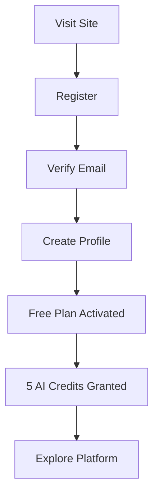

**Steps:**
1. User visits registration page
2. Fills form (name, email, username, password)
3. Receives verification email with custom welcome
4. Clicks verification link
5. Auto-assigned free plan with 5 AI credits
6. Redirected to profile page

### 2. News Fact-Checking Workflow
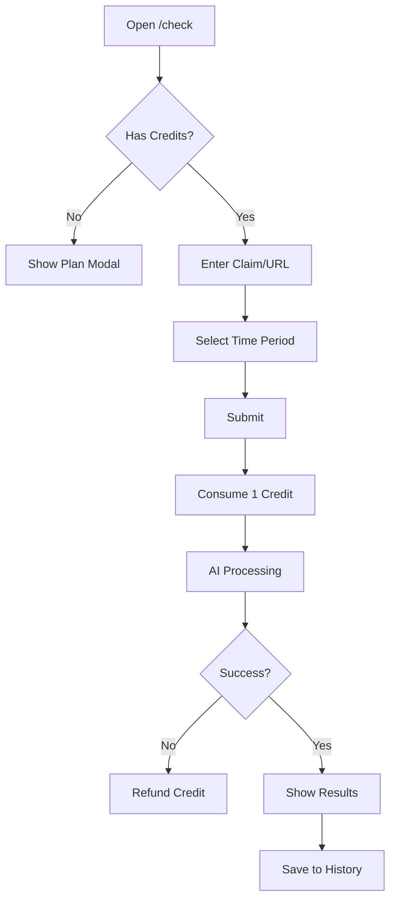

**Credit Consumption Rules:**
- 1 credit per verification/search
- Credits refunded on API errors
- Recurring credits reset monthly
- Bonus credits never expire

### 3. Journalist Application Workflow
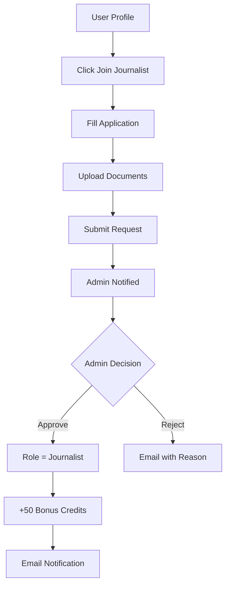

**Requirements:**
- Message explaining qualifications (min 10 chars)
- Optional document upload (PDF, DOC, images)
- Only one pending request allowed

### 4. Article Creation Workflow
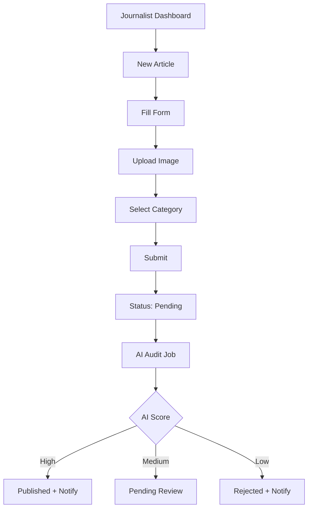

**AI Audit Criteria:**
- Language quality (Arabic fluency)
- Policy compliance
- Content originality
- Spelling accuracy (>80%)

### 5. Subscription & Payment Workflow
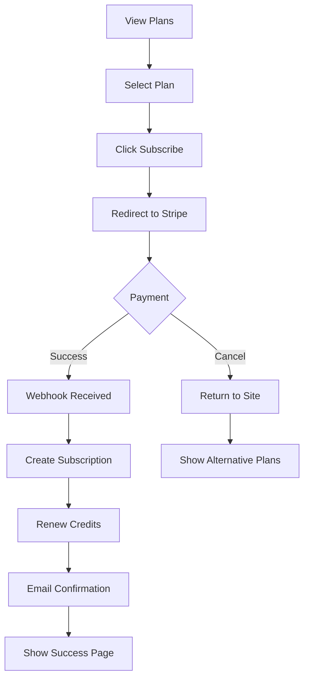

### 6. Post Reporting Workflow
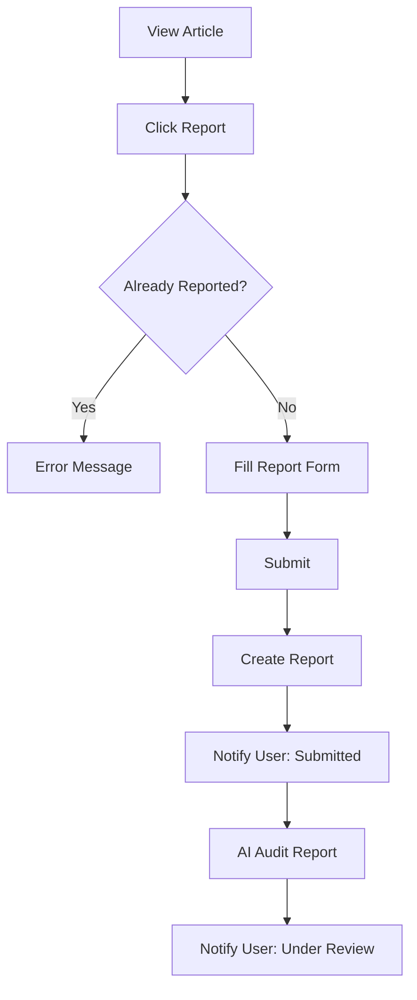

---

## 🔧 Admin Workflows

### 1. Dashboard Overview
```
┌─────────────────────────────────────────────────────────────┐
│  ADMIN DASHBOARD                                            │
├─────────────────────────────────────────────────────────────┤
│  📊 STATS    │  👥 USERS   │  📰 POSTS  │  💳 REVENUE      │
│  ─────────   │  ─────────  │  ─────────  │  ─────────       │
│  Total: 1.2K │  New: 45    │  Total: 892 │  MTD: $2,340     │
│  Active: 890 │  Verified:  │  Published: │  MoM: +12%       │
│  Pending: 23 │  312        │  756        │                  │
└─────────────────────────────────────────────────────────────┘
```

### 2. Journalist Request Management
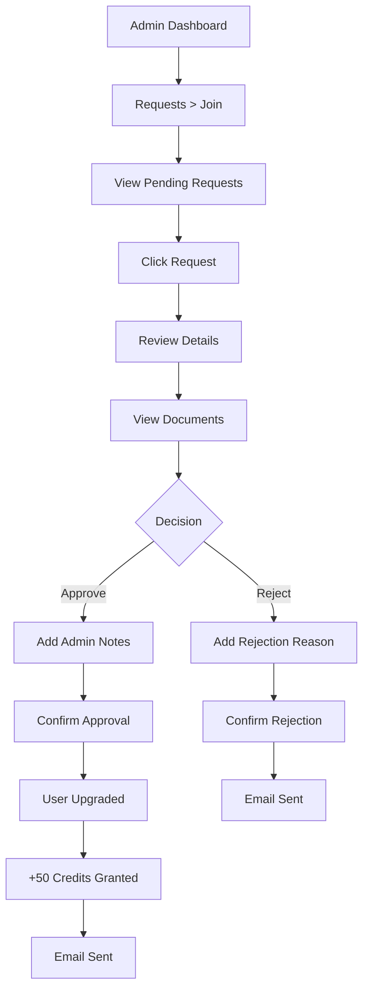

### 3. Content Moderation Workflow
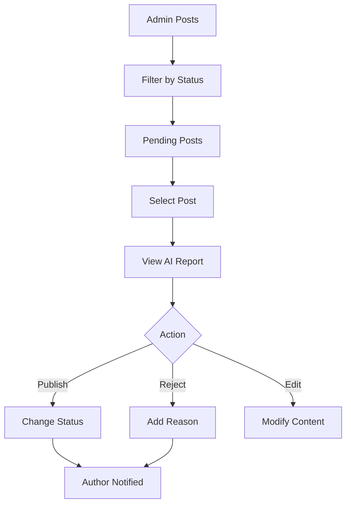

### 4. Report Management Workflow
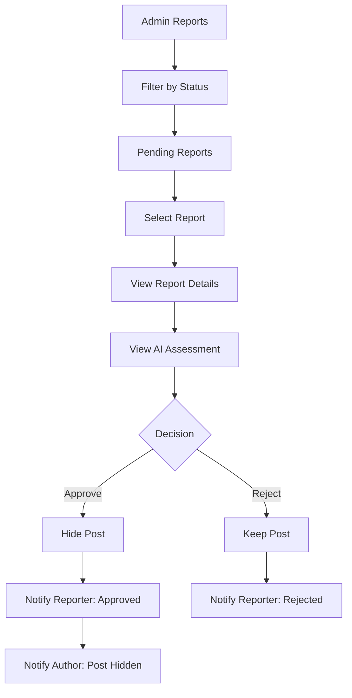

### 5. Homepage Management
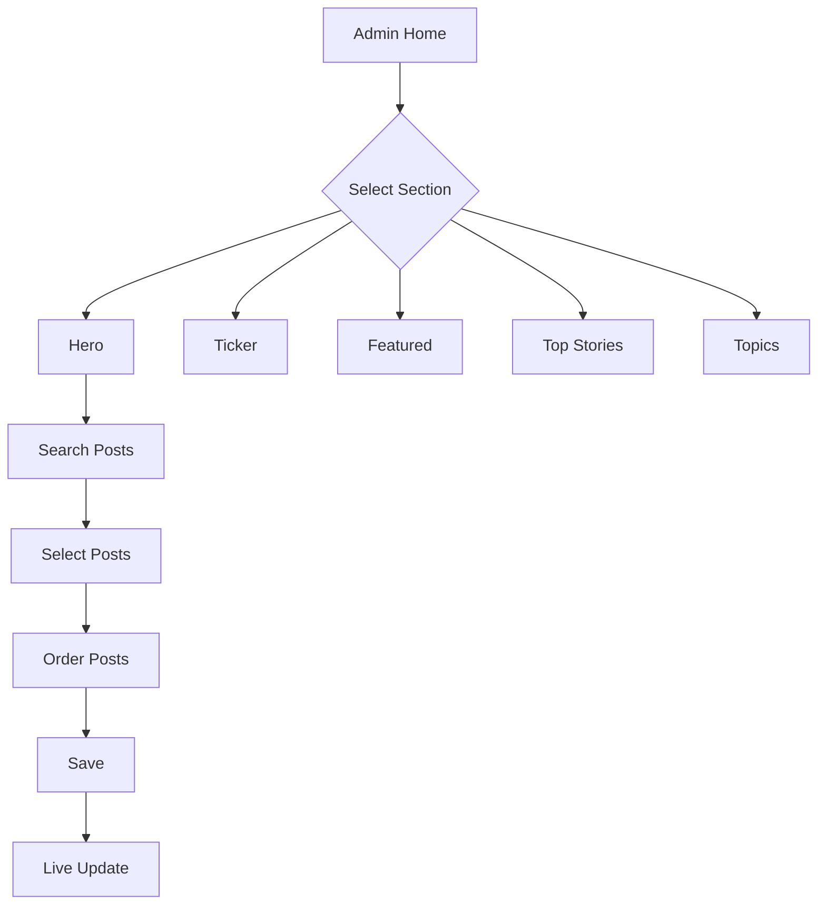

### 6. Payment Reconciliation (Automated)
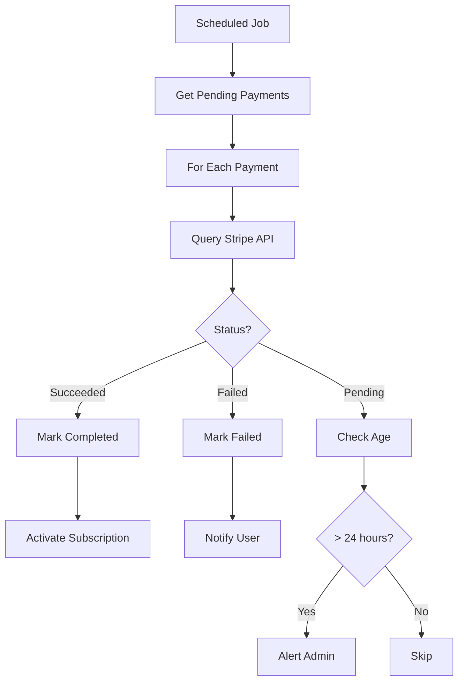

---

## 📁 Project Structure

```
Mudakkik/
├── app/
│   ├── Console/                    # Artisan commands
│   ├── Contracts/                  # Interfaces
│   ├── DTOs/                       # Data Transfer Objects
│   ├── Http/
│   │   ├── Controllers/
│   │   │   ├── Admin/              # Admin panel controllers
│   │   │   │   ├── Home/           # Homepage section controllers
│   │   │   │   ├── AdminDashboardController.php
│   │   │   │   ├── AdminReportController.php
│   │   │   │   ├── JoinRequestController.php
│   │   │   │   ├── PostController.php
│   │   │   │   └── ...
│   │   │   ├── Auth/               # Authentication controllers
│   │   │   ├── Webhooks/           # Stripe webhook handler
│   │   │   ├── FactCheckController.php
│   │   │   ├── PaymentController.php
│   │   │   ├── PostReportController.php
│   │   │   ├── SubscriptionController.php
│   │   │   ├── UpgradeRequestController.php
│   │   │   └── UserPostController.php
│   │   ├── Middleware/
│   │   └── Requests/               # Form request validation
│   ├── Jobs/
│   │   ├── AuditPostContent.php    # AI post auditing
│   │   ├── AuditReportContent.php  # AI report auditing
│   │   ├── HandleExpiredSubscriptions.php
│   │   ├── ProcessStripeWebhook.php
│   │   └── ReconcilePendingPayments.php
│   ├── Models/
│   │   ├── User.php                # Multi-role user with credits
│   │   ├── Post.php                # Articles with AI verdicts
│   │   ├── Plan.php                # Subscription plans
│   │   ├── Subscription.php        # User subscriptions
│   │   ├── Payment.php             # Payment records
│   │   ├── FactCheck.php           # Verification results
│   │   ├── PostReport.php          # User reports
│   │   └── ...
│   ├── Notifications/              # 19 notification types
│   ├── Observers/
│   ├── Providers/
│   ├── Rules/                      # Custom validation
│   └── Services/
│       ├── AiAuditService.php      # Groq AI integration
│       ├── FactCheckServices.php   # Tavily + AI verification
│       ├── HomePageService.php     # Dynamic homepage
│       └── Payment/                # Stripe payment logic
├── config/
│   ├── horizon.php                 # Queue dashboard config
│   ├── services.php                # External API keys
│   └── ...
├── database/
│   ├── factories/
│   ├── migrations/                 # 34 migration files
│   └── seeders/
├── resources/js/
│   ├── Components/                 # Reusable React components
│   │   ├── Header.jsx
│   │   ├── Footer.jsx
│   │   ├── Notifications.jsx
│   │   └── ...
│   ├── Layouts/
│   │   ├── AdminLayout.jsx
│   │   ├── AuthenticatedLayout.jsx
│   │   └── GuestLayout.jsx
│   └── Pages/
│       ├── Admin/                  # Admin panel pages
│       ├── Auth/                   # Login, Register, etc.
│       ├── Home/                   # Homepage components
│       ├── Posts/                  # Article pages
│       ├── Profile/                # User profile
│       ├── Subscriptions/          # Plan pages
│       └── VerifyNews.jsx          # Fact-check interface
├── routes/
│   ├── auth.php                    # Authentication routes
│   └── web.php                     # Main application routes
├── scripts/
│   ├── deploy.sh                   # Deployment script
│   ├── ec2-setup.sh                # Server setup
│   ├── nginx.conf                  # Nginx configuration
│   └── supervisor.conf             # Queue worker config
├── tests/
│   ├── Feature/                    # 16 feature tests
│   └── Unit/                       # 2 unit tests
└── .github/workflows/
    └── deploy.yml                  # CI/CD pipeline
```

---

## 🚀 Installation

### Prerequisites
- PHP >= 8.2 with extensions: redis, gd, mbstring
- Composer 2.x
- Node.js 18+ & npm 9+
- MySQL 8.0+ or PostgreSQL 14+
- Redis 6+

### Quick Start

```bash
# 1. Clone the repository
git clone <repository-url>
cd Mudakkik

# 2. Run setup script
composer setup

# 3. Configure environment (see below)
cp .env.example .env
# Edit .env with your settings

# 4. Start development server
composer run dev
```

The `composer run dev` command starts:
- 🌐 Laravel server (http://localhost:8000)
- 📬 Queue worker
- 📋 Log tailing (Pail)
- ⚡ Vite dev server

---

## ⚙️ Environment Configuration

### Required Environment Variables

```env
#──────────────────────────────────────────────────────────────
# APPLICATION
#──────────────────────────────────────────────────────────────
APP_NAME=Mudakkik
APP_ENV=local
APP_KEY=                          # Run: php artisan key:generate
APP_DEBUG=true
APP_URL=http://localhost:8000

APP_LOCALE=ar
APP_FALLBACK_LOCALE=en
APP_FAKER_LOCALE=ar_SA

#──────────────────────────────────────────────────────────────
# DATABASE
#──────────────────────────────────────────────────────────────
DB_CONNECTION=mysql
DB_HOST=127.0.0.1
DB_PORT=3306
DB_DATABASE=mudakkik
DB_USERNAME=root
DB_PASSWORD=

#──────────────────────────────────────────────────────────────
# REDIS (Required for Queue & Horizon)
#──────────────────────────────────────────────────────────────
REDIS_CLIENT=phpredis
REDIS_HOST=127.0.0.1
REDIS_PASSWORD=null
REDIS_PORT=6379

#──────────────────────────────────────────────────────────────
# QUEUE
#──────────────────────────────────────────────────────────────
QUEUE_CONNECTION=redis            # Use 'sync' for development without Redis

#──────────────────────────────────────────────────────────────
# SESSION & CACHE
#──────────────────────────────────────────────────────────────
SESSION_DRIVER=database
CACHE_STORE=redis                 # Use 'database' without Redis

#──────────────────────────────────────────────────────────────
# MAIL
#──────────────────────────────────────────────────────────────
MAIL_MAILER=smtp
MAIL_HOST=smtp.gmail.com
MAIL_PORT=587
MAIL_USERNAME=your_email@gmail.com
MAIL_PASSWORD=your_app_password   # Gmail App Password
MAIL_ENCRYPTION=tls
MAIL_FROM_ADDRESS=noreply@mudakkik.com
MAIL_FROM_NAME="${APP_NAME}"

#──────────────────────────────────────────────────────────────
# STRIPE PAYMENTS
#──────────────────────────────────────────────────────────────
STRIPE_KEY=pk_test_xxx            # Stripe publishable key
STRIPE_SECRET=sk_test_xxx         # Stripe secret key
STRIPE_WEBHOOK_SECRET=whsec_xxx   # Stripe webhook signing secret

#──────────────────────────────────────────────────────────────
# AI SERVICES
#──────────────────────────────────────────────────────────────
GROQ_API_KEY=gsk_xxx              # Groq API key for LLaMA
TAVILY_API_KEY=tvly_xxx           # Tavily API for news search

#──────────────────────────────────────────────────────────────
# LARAVEL REVERB (WebSocket Broadcasting)
#──────────────────────────────────────────────────────────────
BROADCAST_CONNECTION=reverb

REVERB_APP_ID=1001
REVERB_APP_KEY=mudakkik-reverb-key
REVERB_APP_SECRET=mudakkik-reverb-secret
REVERB_HOST=localhost
REVERB_PORT=8080
REVERB_SCHEME=http

# Vite needs these for client-side WebSocket connection
VITE_REVERB_APP_KEY="${REVERB_APP_KEY}"
VITE_REVERB_HOST="${REVERB_HOST}"
VITE_REVERB_PORT="${REVERB_PORT}"
VITE_REVERB_SCHEME="${REVERB_SCHEME}"

#──────────────────────────────────────────────────────────────
# FILESYSTEM
#──────────────────────────────────────────────────────────────
FILESYSTEM_DISK=local

# For production with S3:
# AWS_ACCESS_KEY_ID=
# AWS_SECRET_ACCESS_KEY=
# AWS_DEFAULT_REGION=us-east-1
# AWS_BUCKET=
```

### Production Considerations

```env
# Production overrides
APP_ENV=production
APP_DEBUG=false
APP_URL=https://mudakkik.com

# Use Redis for everything in production
CACHE_STORE=redis
SESSION_DRIVER=redis
QUEUE_CONNECTION=redis

# Secure WebSocket in production
REVERB_SCHEME=https
REVERB_HOST=ws.mudakkik.com
REVERB_PORT=443
```

---

## 🧪 Testing

```bash
# Run all tests
composer run test

# Run with coverage
php artisan test --coverage

# Run specific test file
php artisan test tests/Feature/FactCheckAuthTest.php

# Run specific test
php artisan test --filter="test_guest_cannot_verify_news"
```

### Test Categories
- **Feature Tests**: API endpoints, workflows
- **Unit Tests**: Service classes, helpers

---

## 🚢 Deployment

### AWS EC2 Deployment

```bash
# 1. Initial server setup
bash scripts/ec2-setup.sh

# 2. Configure Nginx
sudo cp scripts/nginx.conf /etc/nginx/sites-available/mudakkik
sudo ln -s /etc/nginx/sites-available/mudakkik /etc/nginx/sites-enabled/
sudo nginx -t && sudo systemctl reload nginx

# 3. Configure Supervisor
sudo cp scripts/supervisor.conf /etc/supervisor/conf.d/mudakkik.conf
sudo supervisorctl reread && sudo supervisorctl update

# 4. Deploy
bash scripts/deploy.sh
```

### CI/CD with GitHub Actions

Push to `main` branch triggers automatic deployment via `.github/workflows/deploy.yml`.

---

## 📚 API Reference

### Public Endpoints
| Method | Endpoint | Description |
|--------|----------|-------------|
| `GET` | `/` | Homepage |
| `GET` | `/articles/{slug}` | View article |
| `GET` | `/posts` | List articles |
| `GET` | `/plans` | View plans |
| `GET` | `/check` | Verification page |

### Authenticated Endpoints
| Method | Endpoint | Description |
|--------|----------|-------------|
| `POST` | `/verify-news` | Run AI verification |
| `POST` | `/search-news` | Search news topics |
| `GET` | `/api/fact-check/history` | User's verification history |
| `POST` | `/subscribe/{plan}` | Start subscription |
| `POST` | `/my-posts` | Create article (journalist) |
| `POST` | `/posts/{id}/report` | Report content |

### Admin Endpoints
| Method | Endpoint | Description |
|--------|----------|-------------|
| `GET` | `/admin/dashboard` | Admin overview |
| Resource | `/admin/users` | User management |
| Resource | `/admin/posts` | Content management |
| `GET` | `/admin/reports` | Report moderation |
| `GET` | `/admin/requests/join` | Journalist requests |

### Webhooks
| Method | Endpoint | Description |
|--------|----------|-------------|
| `POST` | `/webhooks/stripe` | Stripe events |

---

## 🔄 Background Jobs

| Job | Queue | Description |
|-----|-------|-------------|
| `AuditPostContent` | default | AI audits new articles |
| `AuditReportContent` | default | AI evaluates user reports |
| `ProcessStripeWebhook` | high | Handles Stripe events |
| `HandleExpiredSubscriptions` | low | Expires old subscriptions |
| `ReconcilePendingPayments` | low | Syncs payment status |

---

## 📬 Notification System

| Notification | Channels | Trigger |
|--------------|----------|---------|
| `WelcomeNewUser` | mail | User registration |
| `CustomVerifyEmail` | mail | Email verification |
| `JournalistApproved` | mail, database | Request approved |
| `PostPublished` | database | Article published |
| `PostRejected` | database | Article rejected |
| `PostPendingReview` | database | Needs manual review |
| `ReportSubmitted` | database | Report created |
| `ReportApproved` | database | Report action taken |
| `ReportRejected` | database | Report dismissed |
| `PaymentSuccessful` | mail, database | Payment completed |
| `PaymentFailed` | mail, database | Payment failed |
| `SubscriptionCreated` | mail, database | New subscription |
| `SubscriptionExpired` | mail, database | Subscription ended |


