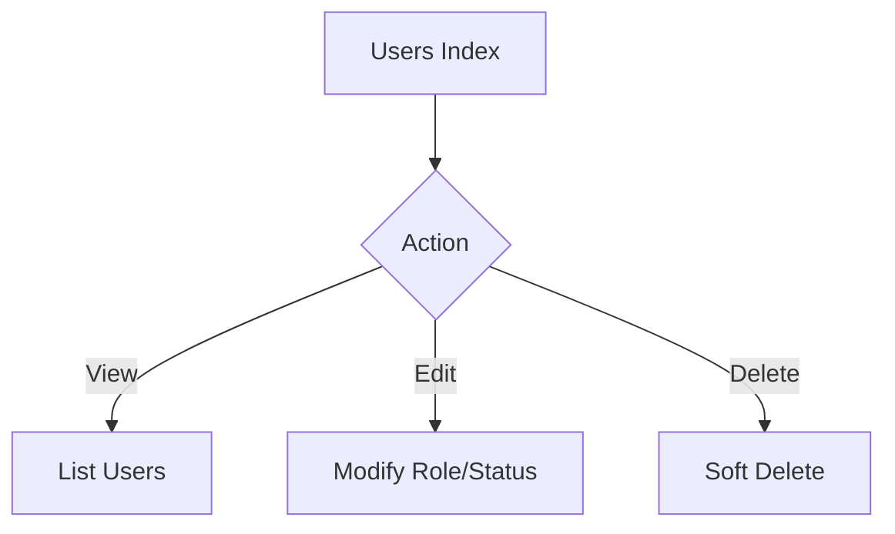
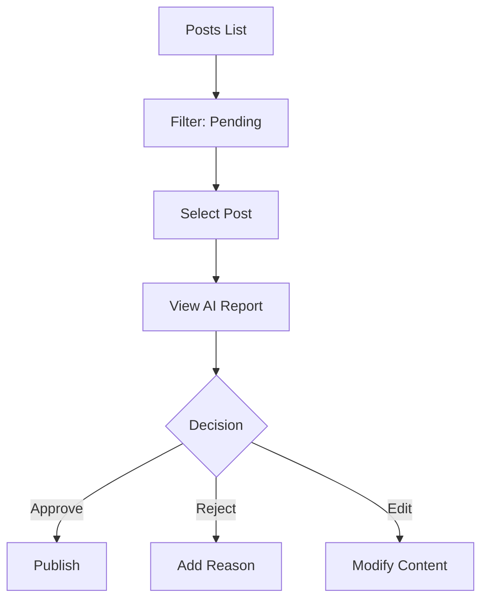
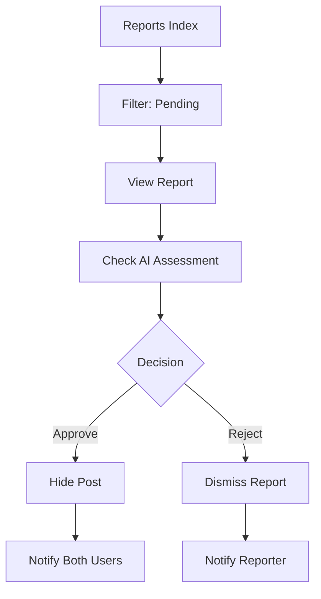
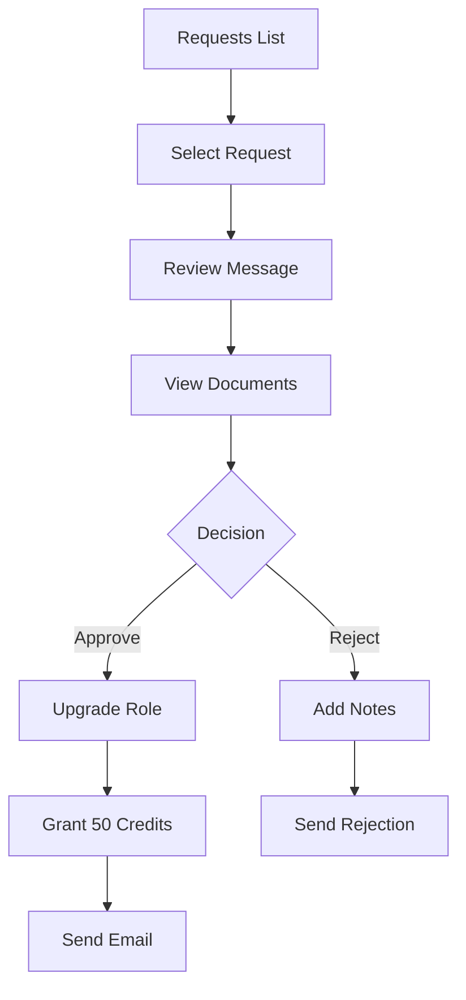
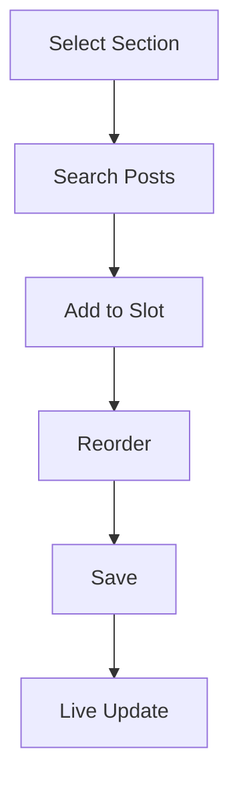

# 🔧 Admin Workflows

> Comprehensive documentation for platform administration and moderation.

---

## Table of Contents
- [Admin Dashboard](#1-admin-dashboard)
- [User Management](#2-user-management)
- [Content Moderation](#3-content-moderation)
- [Report Management](#4-report-management)
- [Journalist Requests](#5-journalist-requests)
- [Homepage Management](#6-homepage-management)

---

## 1. Admin Dashboard

### Access Control
```php
Route::middleware(['auth', 'verified', 'can:admin-access'])
    ->prefix('admin')->name('admin.')
```

### Dashboard Statistics
| Stat | Description |
|------|-------------|
| Total Users | Registered users |
| New Users | This month |
| Total Posts | All articles |
| Published | Live articles |
| Pending | Awaiting review |
| Revenue | Monthly payments |

### Quick Actions
- 🔴 Pending Posts → Review content
- 🟠 Pending Reports → Handle reports
- 🟡 Join Requests → Process applications
- 🔵 Ad Requests → Manage ads

---

## 2. User Management

### User CRUD Operations



### User Filters
| Filter | Options |
|--------|---------|
| Search | Name, email, username |
| Role | user, journalist, admin |
| Status | active, inactive |

### Role Management
| Role | Create Posts | Moderate | Admin |
|------|-------------|----------|-------|
| User | ❌ | ❌ | ❌ |
| Journalist | ✅ | ❌ | ❌ |
| Admin | ✅ | ✅ | ✅ |

---

## 3. Content Moderation

### Post Management



### AI Audit Review
| Field | Description |
|-------|-------------|
| Score | 0-100 quality score |
| Verdict | published/pending/rejected |
| Type | trusted/misleading/fake |
| Notes | Arabic feedback |

### Post Flags
- `is_featured` - Featured section
- `is_breaking` - News ticker
- `is_cover_story` - Hero (only 1)
- `is_editors_choice` - Editor picks

---

## 4. Report Management

### Report Workflow



### Report Statuses
| Status | Action |
|--------|--------|
| Pending | Awaiting review |
| Approved | Post hidden |
| Rejected | Report dismissed |

---

## 5. Journalist Requests

### Approval Workflow



### Approval Effects
| Property | Change |
|----------|--------|
| `role` | → journalist |
| `is_verified_journalist` | → true |
| `credibility_score` | → 50 |
| `ai_bonus_credits` | +50 |

---

## 6. Homepage Management

### Sections

| Section | Slots | Purpose |
|---------|-------|---------|
| Hero | 5 | Main featured |
| Ticker | 10 | Breaking news |
| Featured | 6 | Carousel |
| Top Stories | 4 | Top news |
| Topics | Per category | Category blocks |
| Banner | 1 | Promotional |

### Management Flow



---

## Admin Routes Reference

| Route | Purpose |
|-------|---------|
| `/admin/dashboard` | Dashboard |
| `/admin/users` | Users |
| `/admin/posts` | Posts |
| `/admin/ai-audit` | AI Review |
| `/admin/reports` | Reports |
| `/admin/requests/join` | Join Requests |
| `/admin/subscriptions` | Subscriptions |
| `/admin/payments` | Payments |
| `/admin/categories` | Categories |
| `/admin/tags` | Tags |
| `/admin/plans` | Plans |
| `/admin/policies` | Policies |
| `/admin/trusted-domains` | Domains |
| `/admin/home/*` | Homepage |
