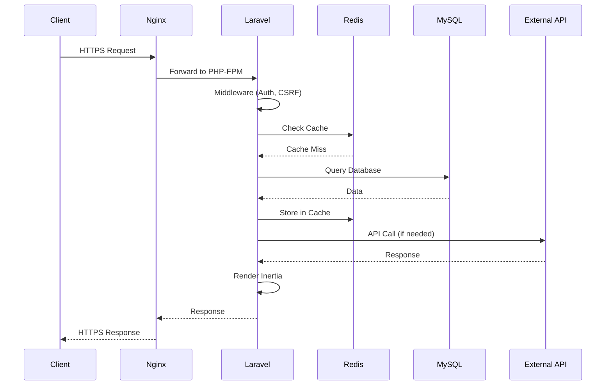
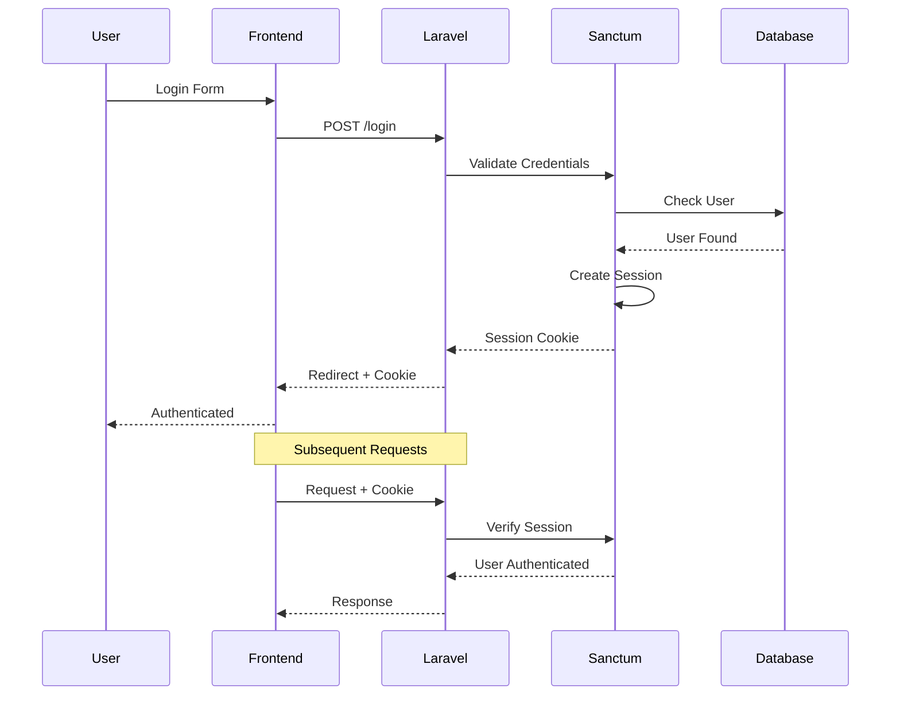
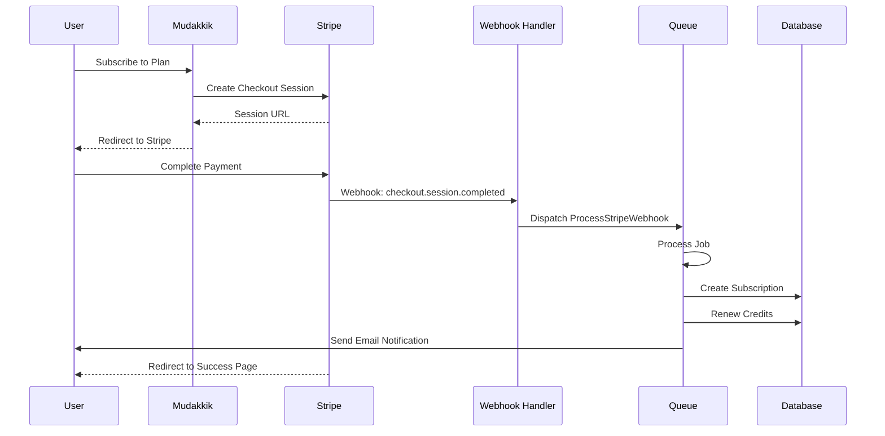
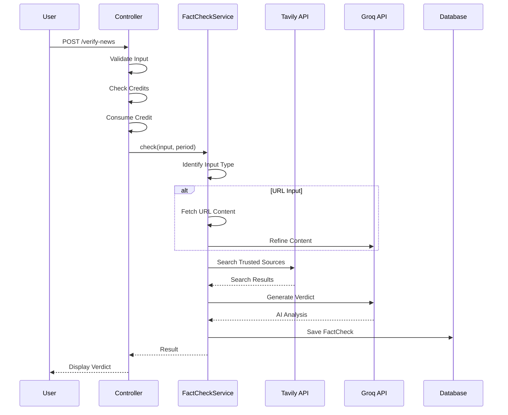

# 🏗️ System Architecture

> Complete system architecture documentation for Mudakkik.

---

## High-Level Architecture

```
┌─────────────────────────────────────────────────────────────────────────────┐
│                              CLIENTS                                        │
├─────────────────────────────────────────────────────────────────────────────┤
│  ┌───────────────┐  ┌───────────────┐  ┌───────────────┐                   │
│  │   Web Browser │  │  Mobile Web   │  │   API Client  │                   │
│  │   (React SPA) │  │  (Responsive) │  │  (Enterprise) │                   │
│  └───────┬───────┘  └───────┬───────┘  └───────┬───────┘                   │
│          │                  │                  │                            │
│          └──────────────────┼──────────────────┘                            │
│                             │                                               │
│                             ▼                                               │
│                    ┌────────────────┐                                       │
│                    │   HTTPS/WSS   │                                       │
│                    └────────┬───────┘                                       │
└─────────────────────────────┼───────────────────────────────────────────────┘
                              │
┌─────────────────────────────┼───────────────────────────────────────────────┐
│                             ▼                                               │
│                    ┌────────────────┐                                       │
│                    │     NGINX     │  Load Balancer / Reverse Proxy        │
│                    │  (Port 80/443)│                                       │
│                    └────────┬───────┘                                       │
│                             │                                               │
│         ┌───────────────────┼───────────────────┐                          │
│         │                   │                   │                          │
│         ▼                   ▼                   ▼                          │
│  ┌─────────────┐    ┌─────────────┐    ┌─────────────┐                    │
│  │  PHP-FPM   │    │   Reverb    │    │   Static    │                    │
│  │ (Laravel)  │    │ (WebSocket) │    │  Assets     │                    │
│  │ Port 9000  │    │ Port 8080   │    │  /public    │                    │
│  └──────┬──────┘    └─────────────┘    └─────────────┘                    │
│         │                                                                   │
│                           APPLICATION LAYER                                 │
└─────────┼───────────────────────────────────────────────────────────────────┘
          │
┌─────────┼───────────────────────────────────────────────────────────────────┐
│         ▼                                                                   │
│  ┌─────────────────────────────────────────────────────────────────────┐   │
│  │                          LARAVEL 12                                  │   │
│  ├─────────────────────────────────────────────────────────────────────┤   │
│  │                                                                      │   │
│  │  ┌──────────────┐  ┌──────────────┐  ┌──────────────┐              │   │
│  │  │   Routing    │  │  Middleware  │  │  Controllers │              │   │
│  │  │   (web.php)  │  │  (auth,etc)  │  │  (HTTP)      │              │   │
│  │  └──────────────┘  └──────────────┘  └──────────────┘              │   │
│  │                                                                      │   │
│  │  ┌──────────────┐  ┌──────────────┐  ┌──────────────┐              │   │
│  │  │   Services   │  │    Jobs      │  │   Events     │              │   │
│  │  │FactCheck,AI  │  │ Audit,Pay    │  │ Notifications│              │   │
│  │  └──────────────┘  └──────────────┘  └──────────────┘              │   │
│  │                                                                      │   │
│  │  ┌──────────────┐  ┌──────────────┐  ┌──────────────┐              │   │
│  │  │   Models     │  │  Eloquent    │  │   Inertia    │              │   │
│  │  │   (ORM)      │  │   Queries    │  │   Responses  │              │   │
│  │  └──────────────┘  └──────────────┘  └──────────────┘              │   │
│  │                                                                      │   │
│  └─────────────────────────────────────────────────────────────────────┘   │
│                                                                             │
│                           LARAVEL CORE                                      │
└─────────────────────────────────────────────────────────────────────────────┘
          │
          │
┌─────────┼───────────────────────────────────────────────────────────────────┐
│         ▼                                                                   │
│  ┌─────────────────────────────────────────────────────────────────────┐   │
│  │                        DATA LAYER                                    │   │
│  ├─────────────────────────────────────────────────────────────────────┤   │
│  │                                                                      │   │
│  │  ┌──────────────┐  ┌──────────────┐  ┌──────────────┐              │   │
│  │  │    MySQL     │  │    Redis     │  │   Storage    │              │   │
│  │  │   Primary    │  │ Cache/Queue  │  │   (Files)    │              │   │
│  │  │   Database   │  │   Session    │  │   Images     │              │   │
│  │  │  Port 3306   │  │  Port 6379   │  │  /storage    │              │   │
│  │  └──────────────┘  └──────────────┘  └──────────────┘              │   │
│  │                                                                      │   │
│  └─────────────────────────────────────────────────────────────────────┘   │
│                                                                             │
│                           DATA STORAGE                                      │
└─────────────────────────────────────────────────────────────────────────────┘
          │
          │
┌─────────┼───────────────────────────────────────────────────────────────────┐
│         ▼                                                                   │
│  ┌─────────────────────────────────────────────────────────────────────┐   │
│  │                     EXTERNAL SERVICES                                │   │
│  ├─────────────────────────────────────────────────────────────────────┤   │
│  │                                                                      │   │
│  │  ┌──────────────┐  ┌──────────────┐  ┌──────────────┐              │   │
│  │  │   Groq API   │  │  Tavily API  │  │   Stripe     │              │   │
│  │  │   (LLaMA)    │  │   (Search)   │  │  (Payments)  │              │   │
│  │  │  AI Audit    │  │  Fact Check  │  │  Webhooks    │              │   │
│  │  └──────────────┘  └──────────────┘  └──────────────┘              │   │
│  │                                                                      │   │
│  │  ┌──────────────┐                                                   │   │
│  │  │   SMTP       │                                                   │   │
│  │  │   (Email)    │                                                   │   │
│  │  │  Gmail/SES   │                                                   │   │
│  │  └──────────────┘                                                   │   │
│  │                                                                      │   │
│  └─────────────────────────────────────────────────────────────────────┘   │
│                                                                             │
│                           EXTERNAL APIs                                     │
└─────────────────────────────────────────────────────────────────────────────┘
```

---

## Request Flow



---

## Component Diagram

```
┌─────────────────────────────────────────────────────────────────┐
│                     FRONTEND (React)                            │
├─────────────────────────────────────────────────────────────────┤
│  ┌─────────┐  ┌─────────┐  ┌─────────┐  ┌─────────┐           │
│  │  Pages  │  │ Layouts │  │Components│  │  Hooks  │           │
│  └─────────┘  └─────────┘  └─────────┘  └─────────┘           │
│       │            │            │            │                  │
│       └────────────┴────────────┴────────────┘                  │
│                          │                                      │
│                   ┌──────┴──────┐                              │
│                   │  Inertia.js │                              │
│                   └──────┬──────┘                              │
└──────────────────────────┼──────────────────────────────────────┘
                           │
┌──────────────────────────┼──────────────────────────────────────┐
│                          ▼                                      │
│  ┌─────────────────────────────────────────────────────────┐   │
│  │                    CONTROLLERS                           │   │
│  ├─────────────────────────────────────────────────────────┤   │
│  │ FactCheck │ Post │ Payment │ Subscription │ User │ Admin│   │
│  └─────────────────────────────────────────────────────────┘   │
│                          │                                      │
│  ┌─────────────────────────────────────────────────────────┐   │
│  │                     SERVICES                             │   │
│  ├─────────────────────────────────────────────────────────┤   │
│  │ FactCheckService │ AiAuditService │ PaymentService │     │   │
│  │ HomePageService  │                                       │   │
│  └─────────────────────────────────────────────────────────┘   │
│                          │                                      │
│  ┌─────────────────────────────────────────────────────────┐   │
│  │                      JOBS                                │   │
│  ├─────────────────────────────────────────────────────────┤   │
│  │ AuditPostContent │ AuditReportContent │                 │   │
│  │ ProcessStripeWebhook │ ReconcilePendingPayments │       │   │
│  │ HandleExpiredSubscriptions │                             │   │
│  └─────────────────────────────────────────────────────────┘   │
│                          │                                      │
│  ┌─────────────────────────────────────────────────────────┐   │
│  │                     MODELS                               │   │
│  ├─────────────────────────────────────────────────────────┤   │
│  │ User │ Post │ Plan │ Subscription │ Payment │ FactCheck │   │
│  │ Category │ Tag │ Like │ Follow │ PostReport │ ...       │   │
│  └─────────────────────────────────────────────────────────┘   │
│                                                                 │
│                          BACKEND                                │
└─────────────────────────────────────────────────────────────────┘
```

---

## Queue Architecture

```
┌─────────────────────────────────────────────────────────────────┐
│                    QUEUE SYSTEM                                 │
├─────────────────────────────────────────────────────────────────┤
│                                                                 │
│  ┌─────────────────────────────────────────────────────────┐   │
│  │                     DISPATCH                             │   │
│  │  Controller/Service → dispatch(Job) → Redis Queue        │   │
│  └─────────────────────────────────────────────────────────┘   │
│                          │                                      │
│                          ▼                                      │
│  ┌─────────────────────────────────────────────────────────┐   │
│  │                    REDIS QUEUES                          │   │
│  ├─────────────────────────────────────────────────────────┤   │
│  │  high    │ ProcessStripeWebhook                         │   │
│  │  default │ AuditPostContent, AuditReportContent         │   │
│  │  low     │ HandleExpiredSubscriptions, Reconcile...     │   │
│  └─────────────────────────────────────────────────────────┘   │
│                          │                                      │
│                          ▼                                      │
│  ┌─────────────────────────────────────────────────────────┐   │
│  │                 HORIZON WORKERS                          │   │
│  ├─────────────────────────────────────────────────────────┤   │
│  │  Worker 1 │ Worker 2 │ Worker 3 │ ... │ Worker N        │   │
│  │  Process jobs from queues based on priority             │   │
│  └─────────────────────────────────────────────────────────┘   │
│                          │                                      │
│                          ▼                                      │
│  ┌─────────────────────────────────────────────────────────┐   │
│  │                 HORIZON DASHBOARD                        │   │
│  │  /horizon - Monitor jobs, metrics, failed jobs          │   │
│  └─────────────────────────────────────────────────────────┘   │
│                                                                 │
└─────────────────────────────────────────────────────────────────┘
```

---

## Authentication Flow



---

## Payment Flow



---

## Fact-Check Flow



---

## Deployment Architecture

```
┌─────────────────────────────────────────────────────────────────┐
│                      AWS ARCHITECTURE                           │
├─────────────────────────────────────────────────────────────────┤
│                                                                 │
│  ┌───────────────────────────────────────────────────────────┐ │
│  │                     CLOUDFLARE                            │ │
│  │                   (DNS + CDN + DDoS)                      │ │
│  └───────────────────────────────────────────────────────────┘ │
│                          │                                      │
│                          ▼                                      │
│  ┌───────────────────────────────────────────────────────────┐ │
│  │                      EC2 INSTANCE                         │ │
│  │                                                           │ │
│  │  ┌─────────────┐  ┌─────────────┐  ┌─────────────┐       │ │
│  │  │    Nginx    │  │   PHP-FPM   │  │  Supervisor │       │ │
│  │  │  (Port 80)  │  │ (Port 9000) │  │  (Workers)  │       │ │
│  │  └─────────────┘  └─────────────┘  └─────────────┘       │ │
│  │                                                           │ │
│  │  ┌─────────────┐  ┌─────────────┐                        │ │
│  │  │   Redis     │  │   MySQL     │                        │ │
│  │  │ (Port 6379) │  │ (Port 3306) │                        │ │
│  │  └─────────────┘  └─────────────┘                        │ │
│  │                                                           │ │
│  └───────────────────────────────────────────────────────────┘ │
│                                                                 │
│  ┌───────────────────────────────────────────────────────────┐ │
│  │                        S3                                 │ │
│  │                   (File Storage)                          │ │
│  └───────────────────────────────────────────────────────────┘ │
│                                                                 │
└─────────────────────────────────────────────────────────────────┘
```

---

## Security Architecture

```
┌─────────────────────────────────────────────────────────────────┐
│                    SECURITY LAYERS                              │
├─────────────────────────────────────────────────────────────────┤
│                                                                 │
│  LAYER 1: NETWORK                                               │
│  ┌─────────────────────────────────────────────────────────┐   │
│  │ • HTTPS/TLS 1.3                                         │   │
│  │ • Cloudflare DDoS Protection                            │   │
│  │ • AWS Security Groups                                   │   │
│  └─────────────────────────────────────────────────────────┘   │
│                                                                 │
│  LAYER 2: APPLICATION                                           │
│  ┌─────────────────────────────────────────────────────────┐   │
│  │ • CSRF Protection (Laravel)                             │   │
│  │ • XSS Prevention (Blade Escaping)                       │   │
│  │ • SQL Injection (Eloquent Parameterized)                │   │
│  │ • Rate Limiting                                         │   │
│  └─────────────────────────────────────────────────────────┘   │
│                                                                 │
│  LAYER 3: AUTHENTICATION                                        │
│  ┌─────────────────────────────────────────────────────────┐   │
│  │ • Sanctum Session Auth                                  │   │
│  │ • Email Verification                                    │   │
│  │ • Password Hashing (bcrypt, 12 rounds)                  │   │
│  │ • Role-Based Access Control                             │   │
│  └─────────────────────────────────────────────────────────┘   │
│                                                                 │
│  LAYER 4: DATA                                                  │
│  ┌─────────────────────────────────────────────────────────┐   │
│  │ • Encrypted Sessions                                    │   │
│  │ • Hidden Sensitive Fields                               │   │
│  │ • Database Transactions                                 │   │
│  │ • Backup & Recovery                                     │   │
│  └─────────────────────────────────────────────────────────┘   │
│                                                                 │
└─────────────────────────────────────────────────────────────────┘
```

---

## Scaling Considerations

### Horizontal Scaling
```
                    ┌─────────────┐
                    │ Load Balancer│
                    └──────┬──────┘
           ┌───────────────┼───────────────┐
           ▼               ▼               ▼
     ┌──────────┐    ┌──────────┐    ┌──────────┐
     │  App 1   │    │  App 2   │    │  App N   │
     └────┬─────┘    └────┬─────┘    └────┬─────┘
          │               │               │
          └───────────────┼───────────────┘
                          ▼
                  ┌──────────────┐
                  │ Redis Cluster│
                  └──────┬───────┘
                         │
                  ┌──────┴───────┐
                  │ MySQL Primary│
                  │ + Replicas   │
                  └──────────────┘
```

### Caching Strategy
| Layer | Technology | TTL |
|-------|------------|-----|
| HTTP | Cloudflare | 1hr |
| Application | Redis | 5min |
| Query | Eloquent | Request |
| Session | Redis | 2hr |
