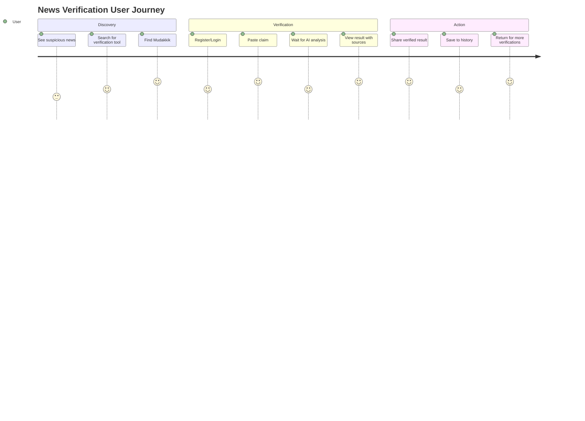
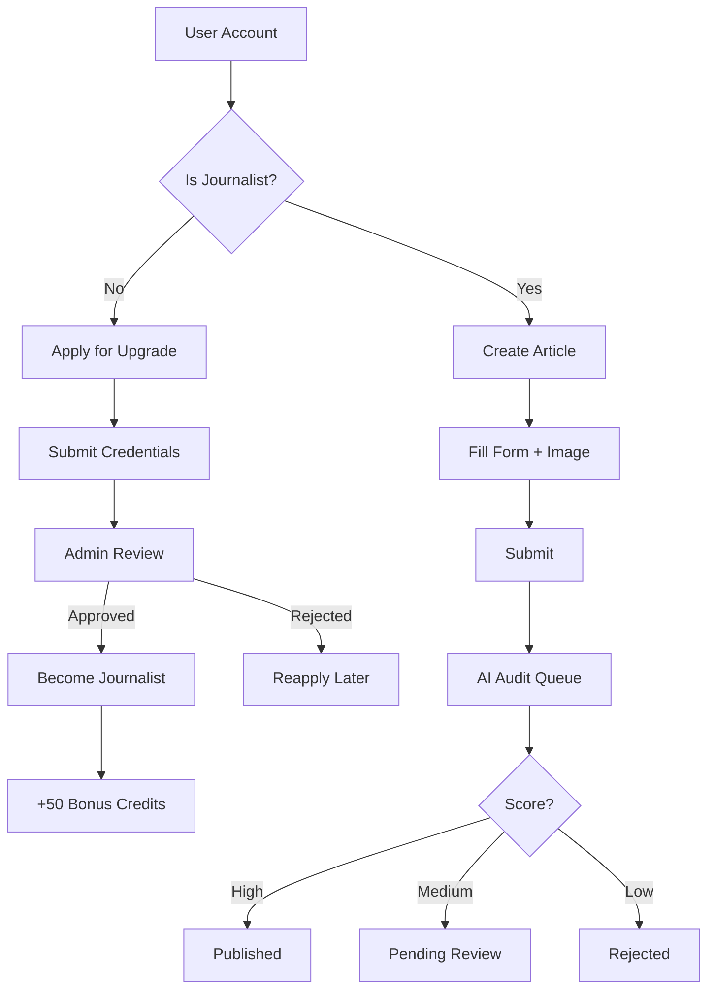
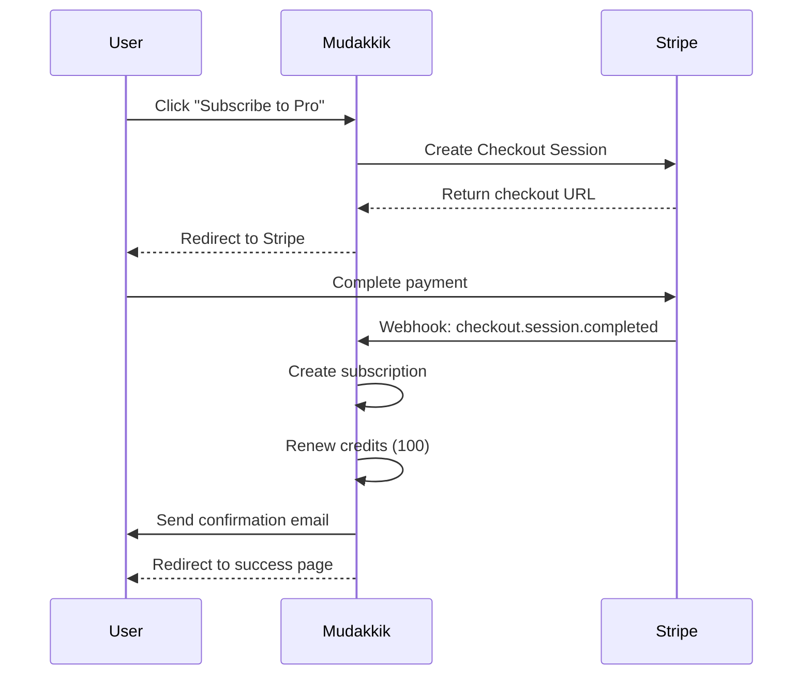
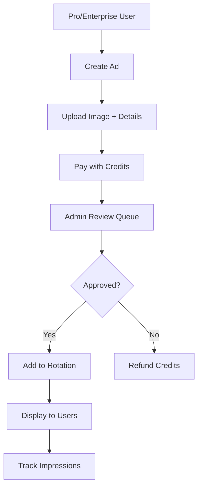

# 💼 Business Scenarios

> Detailed business use cases and monetization strategies for the Mudakkik platform.

---

## Table of Contents
- [Platform Overview](#platform-overview)
- [Scenario 1: News Verification Service](#scenario-1-news-verification-service)
- [Scenario 2: Journalist Publishing Platform](#scenario-2-journalist-publishing-platform)
- [Scenario 3: Subscription Monetization](#scenario-3-subscription-monetization)
- [Scenario 4: Advertising Platform](#scenario-4-advertising-platform)
- [Scenario 5: Content Moderation](#scenario-5-content-moderation)
- [Scenario 6: Enterprise B2B](#scenario-6-enterprise-b2b)
- [Revenue Model](#revenue-model)
- [Growth Strategy](#growth-strategy)
- [Competitive Analysis](#competitive-analysis)

---

## Platform Overview

### Mission Statement
> **"Combating misinformation in the Arabic-speaking world through AI-powered verification."**

### Value Propositions

| Stakeholder | Value |
|-------------|-------|
| **Readers** | Verify news before sharing, avoid spreading misinformation |
| **Journalists** | Publish content with AI quality assurance |
| **Advertisers** | Reach engaged, educated audience |
| **News Organizations** | Improve credibility, reduce fact-check workload |

### Market Opportunity

```
┌─────────────────────────────────────────────────────────────────┐
│                    ARABIC DIGITAL MARKET                        │
├─────────────────────────────────────────────────────────────────┤
│                                                                 │
│   420M+ Arabic speakers worldwide                               │
│   180M+ Internet users in MENA region                           │
│   70%+ get news from social media                               │
│   Misinformation is a major concern for 85%                     │
│                                                                 │
└─────────────────────────────────────────────────────────────────┘
```

---

## Scenario 1: News Verification Service

### The Problem
```
┌─────────────────────────────────────────────────────────────────┐
│                 THE MISINFORMATION PROBLEM                      │
├─────────────────────────────────────────────────────────────────┤
│                                                                 │
│   User sees news on WhatsApp/Twitter                            │
│                    ↓                                            │
│   Can't verify if true or false                                 │
│                    ↓                                            │
│   Shares without verification (70% of users)                    │
│                    ↓                                            │
│   Misinformation spreads virally                                │
│                    ↓                                            │
│   Real-world consequences (panic, division)                     │
│                                                                 │
└─────────────────────────────────────────────────────────────────┘
```

### The Solution

```
┌─────────────────────────────────────────────────────────────────┐
│                    MUDAKKIK SOLUTION                            │
├─────────────────────────────────────────────────────────────────┤
│                                                                 │
│   1. User copies suspicious claim                               │
│                    ↓                                            │
│   2. Pastes into Mudakkik verification                          │
│                    ↓                                            │
│   3. AI searches trusted Arabic sources                         │
│                    ↓                                            │
│   4. Returns verdict with evidence                              │
│      ┌────────────────────────────────┐                         │
│      │ ✅ موثوق (85%)                 │                         │
│      │ Found in: Al Jazeera, BBC      │                         │
│      │ Evidence: [link] [link]        │                         │
│      └────────────────────────────────┘                         │
│                    ↓                                            │
│   5. User shares verified result                                │
│                                                                 │
└─────────────────────────────────────────────────────────────────┘
```

### User Journey



### Business Impact

| Metric | Target |
|--------|--------|
| Daily verifications | 10,000+ |
| User retention (30-day) | 40% |
| Conversion to paid | 5% |
| Brand reputation | Trusted source |

---

## Scenario 2: Journalist Publishing Platform

### The Problem

```
┌─────────────────────────────────────────────────────────────────┐
│              CONTENT MODERATION CHALLENGE                       │
├─────────────────────────────────────────────────────────────────┤
│                                                                 │
│   Traditional Platform:                                         │
│   - Manual review of every article                              │
│   - 24-48 hour publishing delay                                 │
│   - Inconsistent moderation                                     │
│   - High labor costs                                            │
│   - Scalability issues                                          │
│                                                                 │
└─────────────────────────────────────────────────────────────────┘
```

### The Solution

```
┌─────────────────────────────────────────────────────────────────┐
│                AI-POWERED PUBLISHING                            │
├─────────────────────────────────────────────────────────────────┤
│                                                                 │
│   Article Submitted                                             │
│          ↓                                                      │
│   ┌─────────────────────────────────────────┐                   │
│   │           AI AUDIT ENGINE               │                   │
│   │  ┌─────────────────────────────────┐   │                   │
│   │  │ • Language quality check        │   │                   │
│   │  │ • Policy compliance scan        │   │                   │
│   │  │ • Hate speech detection         │   │                   │
│   │  │ • Spelling analysis (>80%)      │   │                   │
│   │  │ • Originality verification      │   │                   │
│   │  └─────────────────────────────────┘   │                   │
│   │              ↓                          │                   │
│   │         Score: 0-100                    │                   │
│   └─────────────────────────────────────────┘                   │
│          ↓              ↓              ↓                        │
│      Score ≥70      40-69          <40                          │
│         ↓              ↓              ↓                         │
│    ✅ PUBLISH     ⏳ REVIEW      ❌ REJECT                       │
│     (auto)        (manual)        (auto)                        │
│                                                                 │
└─────────────────────────────────────────────────────────────────┘
```

### Journalist Journey



### Business Impact

| Metric | Before AI | After AI |
|--------|-----------|----------|
| Publishing time | 24-48 hours | < 5 minutes |
| Manual reviews | 100% | 20% |
| Moderation cost | $10/article | $0.05/article |
| Consistency | Variable | 95%+ |

---

## Scenario 3: Subscription Monetization

### Pricing Strategy

```
┌─────────────────────────────────────────────────────────────────┐
│                    SUBSCRIPTION TIERS                           │
├─────────────────────────────────────────────────────────────────┤
│                                                                 │
│  ┌─────────────┐  ┌─────────────┐  ┌─────────────┐             │
│  │    FREE     │  │   BASIC     │  │    PRO      │             │
│  ├─────────────┤  ├─────────────┤  ├─────────────┤             │
│  │   $0/mo     │  │  $29/mo     │  │  $99/mo     │             │
│  ├─────────────┤  ├─────────────┤  ├─────────────┤             │
│  │ 30 AI creds │  │ 100 AI creds│  │ 1000 AI creds│            │
│  │ 0 ad creds  │  │ 7 ad creds  │  │ 30 ad creds │             │
│  │ No badge    │  │ Bronze badge│  │ Gold badge  │             │
│  └─────────────┘  └─────────────┘  └─────────────┘             │
│                                                                 │
│  ┌─────────────────────────────────────────────────┐           │
│  │              PRO ANNUAL                          │           │
│  ├─────────────────────────────────────────────────┤           │
│  │                $999/year                         │           │
│  ├─────────────────────────────────────────────────┤           │
│  │ • 12,000 AI credits per year                    │           │
│  │ • 365 ad credits per year                       │           │
│  │ • Platinum verification badge                   │           │
│  │ • Priority support                              │           │
│  └─────────────────────────────────────────────────┘           │
│                                                                 │
└─────────────────────────────────────────────────────────────────┘
```

### Conversion Funnel

```
                    ┌─────────────────┐
                    │     VISITORS    │
                    │    100,000/mo   │
                    └────────┬────────┘
                             │
                    Register (10%)
                             ▼
                    ┌─────────────────┐
                    │   FREE USERS    │
                    │     10,000      │
                    └────────┬────────┘
                             │
                    Use 30 free credits
                             │
                    Hit limit (40%)
                             ▼
                    ┌─────────────────┐
                    │  LIMIT REACHED  │
                    │      4,000      │
                    └────────┬────────┘
                             │
                    Convert (15%)
                             ▼
                    ┌─────────────────┐
                    │  PAID USERS     │
                    │      600        │
                    └────────┬────────┘
                             │
         ┌───────────────────┼───────────────────┐
         │                   │                   │
    Basic (60%)         Pro (35%)        Annual (5%)
         │                   │                   │
     $29 × 360          $99 × 210         $999 × 30
         │                   │                   │
      $10,440             $20,790           $29,970
         │                   │                   │
         └───────────────────┼───────────────────┘
                             │
                    ┌────────┴────────┐
                    │  MONTHLY REVENUE │
                    │    ~$61,200      │
                    └─────────────────┘
```

### Payment Flow



---

## Scenario 4: Advertising Platform

### Self-Serve Ad System

```
┌─────────────────────────────────────────────────────────────────┐
│                    ADVERTISING MODEL                            │
├─────────────────────────────────────────────────────────────────┤
│                                                                 │
│   ADVERTISERS              MUDAKKIK              READERS        │
│   ┌─────────┐            ┌─────────┐           ┌─────────┐     │
│   │ Create  │───────────▶│ Review  │──────────▶│ View    │     │
│   │ Ad      │            │ & Queue │           │ Ads     │     │
│   └─────────┘            └─────────┘           └─────────┘     │
│       │                       │                     │           │
│       ▼                       ▼                     ▼           │
│   Pay credits            Show in rotation      Click/Engage     │
│                                                                 │
└─────────────────────────────────────────────────────────────────┘
```

### Ad Types

| Type | Placement | Cost |
|------|-----------|------|
| **Homepage Banner** | Main page banner | 10 credits/day |
| **Sidebar Ad** | Article sidebar | 5 credits/day |
| **In-feed Ad** | Between articles | 3 credits/day |

### Ad Flow



---

## Scenario 5: Content Moderation

### Moderation Pipeline

```
┌─────────────────────────────────────────────────────────────────┐
│              CONTENT MODERATION PIPELINE                        │
├─────────────────────────────────────────────────────────────────┤
│                                                                 │
│                 ┌─────────────────┐                             │
│                 │  USER CREATES   │                             │
│                 │    CONTENT      │                             │
│                 └────────┬────────┘                             │
│                          │                                      │
│                          ▼                                      │
│   ┌──────────────────────────────────────────────────────┐     │
│   │                 LAYER 1: AI AUDIT                     │     │
│   │  ┌────────────────────────────────────────────────┐  │     │
│   │  │ • Policy compliance (hate speech, violence)    │  │     │
│   │  │ • Language quality (Arabic fluency)            │  │     │
│   │  │ • Spelling accuracy (>80%)                     │  │     │
│   │  │ • Content originality                          │  │     │
│   │  └────────────────────────────────────────────────┘  │     │
│   │                        │                              │     │
│   │          ┌─────────────┼─────────────┐               │     │
│   │          ▼             ▼             ▼               │     │
│   │       PUBLISH       PENDING       REJECT             │     │
│   │        (70%)         (20%)         (10%)             │     │
│   └──────────────────────┼──────────────────────────────┘     │
│                          │                                      │
│                          ▼                                      │
│   ┌──────────────────────────────────────────────────────┐     │
│   │              LAYER 2: COMMUNITY REPORTS               │     │
│   │  ┌────────────────────────────────────────────────┐  │     │
│   │  │ • Users report problematic content             │  │     │
│   │  │ • AI evaluates report validity                 │  │     │
│   │  │ • Admin makes final decision                   │  │     │
│   │  └────────────────────────────────────────────────┘  │     │
│   └──────────────────────────────────────────────────────┘     │
│                          │                                      │
│                          ▼                                      │
│   ┌──────────────────────────────────────────────────────┐     │
│   │               LAYER 3: ADMIN REVIEW                   │     │
│   │  ┌────────────────────────────────────────────────┐  │     │
│   │  │ • Review pending content                       │  │     │
│   │  │ • Action reports                               │  │     │
│   │  │ • Override AI decisions                        │  │     │
│   │  └────────────────────────────────────────────────┘  │     │
│   └──────────────────────────────────────────────────────┘     │
│                                                                 │
└─────────────────────────────────────────────────────────────────┘
```

### Moderation Metrics

| Metric | Target |
|--------|--------|
| AI accuracy | 95%+ |
| False positives | <2% |
| Average review time | <5 min |
| User satisfaction | 90%+ |

---

## Scenario 6: Enterprise B2B

### Enterprise Offering

```
┌─────────────────────────────────────────────────────────────────┐
│                   ENTERPRISE SOLUTION                           │
├─────────────────────────────────────────────────────────────────┤
│                                                                 │
│   FOR NEWS ORGANIZATIONS:                                       │
│   ┌─────────────────────────────────────────────────────────┐  │
│   │ • API access for fact-check integration                 │  │
│   │ • Custom trusted domain list                            │  │
│   │ • White-label verification widget                       │  │
│   │ • Bulk verification processing                          │  │
│   │ • Analytics dashboard                                   │  │
│   │ • Dedicated support                                     │  │
│   └─────────────────────────────────────────────────────────┘  │
│                                                                 │
│   FOR SOCIAL PLATFORMS:                                         │
│   ┌─────────────────────────────────────────────────────────┐  │
│   │ • Misinformation detection API                          │  │
│   │ • Real-time content flagging                            │  │
│   │ • Integration with moderation workflows                 │  │
│   │ • Custom Arabic language models                         │  │
│   └─────────────────────────────────────────────────────────┘  │
│                                                                 │
│   FOR GOVERNMENTS/NGOs:                                         │
│   ┌─────────────────────────────────────────────────────────┐  │
│   │ • Public awareness campaign tools                       │  │
│   │ • Misinformation trend analytics                        │  │
│   │ • Educational integration                               │  │
│   │ • Crisis communication verification                     │  │
│   └─────────────────────────────────────────────────────────┘  │
│                                                                 │
└─────────────────────────────────────────────────────────────────┘
```

### Enterprise API Example

```
POST /api/v1/verify
Authorization: Bearer {enterprise_api_key}

{
  "claim": "Breaking: Major event happened...",
  "sources": ["aljazeera.net", "bbc.com/arabic"],
  "period_days": 7
}

Response:
{
  "verdict": "misleading",
  "confidence": 45,
  "summary": "Claim partially accurate but context missing",
  "sources": [
    {
      "url": "https://aljazeera.net/...",
      "title": "Related coverage",
      "date": "2026-01-10"
    }
  ]
}
```

---

## Revenue Model

### Revenue Streams

```
┌─────────────────────────────────────────────────────────────────┐
│                     REVENUE BREAKDOWN                           │
├─────────────────────────────────────────────────────────────────┤
│                                                                 │
│   ┌───────────────────────────────────────────┐                │
│   │           SUBSCRIPTIONS (70%)             │                │
│   │   ┌─────────────────────────────────┐    │                │
│   │   │ Basic: $29 × 360 = $10,440      │    │                │
│   │   │ Pro:   $99 × 210 = $20,790      │    │                │
│   │   │ Annual: $999 × 30 ÷ 12 = $2,498 │    │                │
│   │   └─────────────────────────────────┘    │                │
│   │           Total: ~$33,700/mo             │                │
│   └───────────────────────────────────────────┘                │
│                                                                 │
│   ┌───────────────────────────────────────────┐                │
│   │           ADVERTISING (20%)               │                │
│   │   ┌─────────────────────────────────┐    │                │
│   │   │ Display ads: $5,000/mo          │    │                │
│   │   │ Self-serve: $2,000/mo           │    │                │
│   │   │ Sponsored content: $2,000/mo    │    │                │
│   │   └─────────────────────────────────┘    │                │
│   │              Total: $9,000/mo             │                │
│   └───────────────────────────────────────────┘                │
│                                                                 │
│   ┌───────────────────────────────────────────┐                │
│   │           ENTERPRISE API (10%)            │                │
│   │   ┌─────────────────────────────────┐    │                │
│   │   │ News orgs: $1,000/mo × 3        │    │                │
│   │   │ Custom integrations: $1,500     │    │                │
│   │   └─────────────────────────────────┘    │                │
│   │              Total: $4,500/mo             │                │
│   └───────────────────────────────────────────┘                │
│                                                                 │
│   ═══════════════════════════════════════════                  │
│         TOTAL MONTHLY REVENUE: ~$47,200                        │
│   ═══════════════════════════════════════════                  │
│                                                                 │
└─────────────────────────────────────────────────────────────────┘
```

### Unit Economics

| Metric | Value |
|--------|-------|
| Customer Acquisition Cost (CAC) | $5 |
| Average Revenue Per User (ARPU) | $7.50/mo |
| Lifetime Value (LTV) | $90 |
| LTV:CAC Ratio | 18:1 |
| Churn Rate | 5%/mo |
| Gross Margin | 85% |

---

## Growth Strategy

### Phase 1: Foundation (Months 1-6)
- Launch MVP with fact-checking
- Build journalist community
- Establish trusted domain network
- Target 10,000 users

### Phase 2: Monetization (Months 7-12)
- Launch subscription plans
- Add advertising platform
- Target 50,000 users
- $5,000 MRR

### Phase 3: Scale (Year 2)
- Enterprise API launch
- Mobile app (iOS/Android)
- Partnerships with news organizations
- Target 200,000 users
- $25,000 MRR

### Phase 4: Expansion (Year 3+)
- Multi-language support
- AI model improvements
- Geographic expansion
- Target 1M+ users
- $100,000+ MRR

---

## Competitive Analysis

### Competitor Landscape

| Player | Strengths | Weaknesses |
|--------|-----------|------------|
| **Google Fact Check** | Scale, brand trust | Not Arabic-focused |
| **Snopes/Politifact** | Established reputation | English only |
| **Local fact-checkers** | Language expertise | Manual, slow |
| **Social media labels** | Reach | Inconsistent, reactive |

### Mudakkik Differentiation

| Factor | Mudakkik Advantage |
|--------|-------------------|
| **Language** | Arabic-first design |
| **Speed** | AI-powered (seconds vs hours) |
| **Sources** | Curated Arab news network |
| **Integration** | Full platform (verify + publish) |
| **Monetization** | Sustainable credit model |

---

## Success Metrics

### Key Performance Indicators

| KPI | Target | Timeframe |
|-----|--------|-----------|
| Monthly Active Users | 50,000 | Year 1 |
| Daily Verifications | 10,000 | Year 1 |
| Paid Subscribers | 2,500 | Year 1 |
| Monthly Revenue | $15,000 | Year 1 |
| User Satisfaction | 90%+ | Ongoing |
| AI Accuracy | 95%+ | Ongoing |
