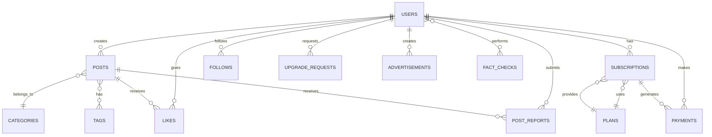

# 🗄️ Database Schema

> Complete database schema documentation for Mudakkik.

---

## Entity Relationship Diagram



---

## Tables Overview

| Table | Description | Records Est. |
|-------|-------------|--------------|
| `users` | User accounts | 10K+ |
| `posts` | Articles/news | 5K+ |
| `categories` | Post categories | 20 |
| `tags` | Post tags | 100+ |
| `subscriptions` | User subscriptions | 5K+ |
| `plans` | Subscription plans | 5 |
| `payments` | Payment records | 10K+ |
| `likes` | Post likes | 50K+ |
| `follows` | User follows | 10K+ |
| `post_reports` | Content reports | 500+ |
| `upgrade_requests` | Journalist apps | 500+ |
| `fact_checks` | Verification results | 20K+ |
| `advertisments` | User ads | 200+ |
| `home_slots` | Homepage config | 50 |
| `trusted_domains` | Fact-check sources | 50 |
| `policies` | Site policies | 5 |

---

## Core Tables

### users
```sql
CREATE TABLE users (
    id BIGINT PRIMARY KEY AUTO_INCREMENT,
    name VARCHAR(255) NOT NULL,
    username VARCHAR(255) UNIQUE NOT NULL,
    email VARCHAR(255) UNIQUE NOT NULL,
    email_verified_at TIMESTAMP NULL,
    password VARCHAR(255) NOT NULL,
    role ENUM('user', 'journalist', 'admin') DEFAULT 'user',
    is_verified_journalist BOOLEAN DEFAULT FALSE,
    credibility_score INT DEFAULT 0,
    ai_recurring_credits INT DEFAULT 5,
    ai_bonus_credits INT DEFAULT 0,
    remember_token VARCHAR(100) NULL,
    created_at TIMESTAMP,
    updated_at TIMESTAMP
);
```

| Column | Type | Description |
|--------|------|-------------|
| `id` | BIGINT | Primary key |
| `name` | VARCHAR | Display name |
| `username` | VARCHAR | Unique username |
| `email` | VARCHAR | Email address |
| `role` | ENUM | user/journalist/admin |
| `is_verified_journalist` | BOOL | Verified status |
| `credibility_score` | INT | Journalist score |
| `ai_recurring_credits` | INT | Monthly credits |
| `ai_bonus_credits` | INT | Bonus credits |

---

### posts
```sql
CREATE TABLE posts (
    id BIGINT PRIMARY KEY AUTO_INCREMENT,
    title VARCHAR(255) NOT NULL,
    slug VARCHAR(255) UNIQUE NOT NULL,
    body TEXT NOT NULL,
    content_hash VARCHAR(32) UNIQUE,
    image VARCHAR(255) NULL,
    status ENUM('pending', 'published', 'rejected') DEFAULT 'pending',
    type ENUM('article', 'news') DEFAULT 'article',
    ai_verdict ENUM('trusted', 'checking', 'misleading', 'fake') NULL,
    ai_score INT NULL,
    ai_report TEXT NULL,
    is_featured BOOLEAN DEFAULT FALSE,
    is_cover_story BOOLEAN DEFAULT FALSE,
    is_breaking BOOLEAN DEFAULT FALSE,
    is_editors_choice BOOLEAN DEFAULT FALSE,
    views INT DEFAULT 0,
    user_id BIGINT NOT NULL,
    category_id BIGINT NOT NULL,
    created_at TIMESTAMP,
    updated_at TIMESTAMP,
    FOREIGN KEY (user_id) REFERENCES users(id),
    FOREIGN KEY (category_id) REFERENCES categories(id)
);
```

| Column | Type | Description |
|--------|------|-------------|
| `slug` | VARCHAR | URL-friendly title |
| `content_hash` | VARCHAR | MD5 for duplicates |
| `status` | ENUM | pending/published/rejected |
| `type` | ENUM | article/news |
| `ai_verdict` | ENUM | AI content verdict |
| `ai_score` | INT | AI quality score |
| `is_featured` | BOOL | Featured flag |

---

### subscriptions
```sql
CREATE TABLE subscriptions (
    id BIGINT PRIMARY KEY AUTO_INCREMENT,
    user_id BIGINT NOT NULL,
    plan_id BIGINT NOT NULL,
    status ENUM('active', 'cancelled', 'expired', 'past_due') DEFAULT 'active',
    provider VARCHAR(50) DEFAULT 'stripe',
    provider_subscription_id VARCHAR(255) NULL,
    start_at TIMESTAMP NOT NULL,
    ends_at TIMESTAMP NULL,
    cancelled_at TIMESTAMP NULL,
    trial_ends_at TIMESTAMP NULL,
    auto_renew BOOLEAN DEFAULT TRUE,
    admin_notes TEXT NULL,
    created_at TIMESTAMP,
    updated_at TIMESTAMP,
    FOREIGN KEY (user_id) REFERENCES users(id),
    FOREIGN KEY (plan_id) REFERENCES plans(id)
);
```

---

### plans
```sql
CREATE TABLE plans (
    id BIGINT PRIMARY KEY AUTO_INCREMENT,
    name VARCHAR(255) NOT NULL,
    slug VARCHAR(255) UNIQUE NOT NULL,
    price DECIMAL(8,2) NOT NULL,
    billing_interval ENUM('monthly', 'yearly', 'lifetime') DEFAULT 'monthly',
    duration_days INT DEFAULT 30,
    provider_price_id VARCHAR(255) NULL,
    is_free BOOLEAN DEFAULT FALSE,
    is_active BOOLEAN DEFAULT TRUE,
    sort_order INT DEFAULT 0,
    features JSON NULL,
    created_at TIMESTAMP,
    updated_at TIMESTAMP
);
```

---

### payments
```sql
CREATE TABLE payments (
    id BIGINT PRIMARY KEY AUTO_INCREMENT,
    user_id BIGINT NOT NULL,
    subscription_id BIGINT NULL,
    plan_id BIGINT NOT NULL,
    amount DECIMAL(8,2) NOT NULL,
    currency VARCHAR(3) DEFAULT 'USD',
    status ENUM('pending', 'completed', 'failed', 'refunded') DEFAULT 'pending',
    provider VARCHAR(50) DEFAULT 'stripe',
    provider_payment_id VARCHAR(255) NULL,
    provider_session_id VARCHAR(255) NULL,
    metadata JSON NULL,
    created_at TIMESTAMP,
    updated_at TIMESTAMP,
    FOREIGN KEY (user_id) REFERENCES users(id),
    FOREIGN KEY (subscription_id) REFERENCES subscriptions(id),
    FOREIGN KEY (plan_id) REFERENCES plans(id)
);
```

---

### fact_checks
```sql
CREATE TABLE fact_checks (
    id BIGINT PRIMARY KEY AUTO_INCREMENT,
    input_text TEXT NOT NULL,
    label VARCHAR(50) NOT NULL,
    confidence INT NOT NULL,
    summary TEXT NULL,
    evidence TEXT NULL,
    sources JSON NULL,
    period INT NULL,
    type ENUM('verify', 'search') DEFAULT 'verify',
    created_at TIMESTAMP,
    updated_at TIMESTAMP
);
```

### fact_check_user (Pivot)
```sql
CREATE TABLE fact_check_user (
    id BIGINT PRIMARY KEY AUTO_INCREMENT,
    user_id BIGINT NOT NULL,
    fact_check_id BIGINT NOT NULL,
    created_at TIMESTAMP,
    FOREIGN KEY (user_id) REFERENCES users(id),
    FOREIGN KEY (fact_check_id) REFERENCES fact_checks(id)
);
```

---

### post_reports
```sql
CREATE TABLE post_reports (
    id BIGINT PRIMARY KEY AUTO_INCREMENT,
    post_id BIGINT NOT NULL,
    user_id BIGINT NOT NULL,
    reason TEXT NOT NULL,
    status ENUM('pending', 'approved', 'rejected') DEFAULT 'pending',
    reviewed_by BIGINT NULL,
    ai_score INT NULL,
    ai_verdict VARCHAR(50) NULL,
    ai_summary TEXT NULL,
    created_at TIMESTAMP,
    updated_at TIMESTAMP,
    FOREIGN KEY (post_id) REFERENCES posts(id),
    FOREIGN KEY (user_id) REFERENCES users(id),
    FOREIGN KEY (reviewed_by) REFERENCES users(id)
);
```

---

### upgrade_requests
```sql
CREATE TABLE upgrade_requests (
    id BIGINT PRIMARY KEY AUTO_INCREMENT,
    user_id BIGINT NOT NULL,
    request_message TEXT NOT NULL,
    documents VARCHAR(255) NULL,
    status ENUM('pending', 'accepted', 'rejected', 'archived') DEFAULT 'pending',
    admin_notes TEXT NULL,
    created_at TIMESTAMP,
    updated_at TIMESTAMP,
    FOREIGN KEY (user_id) REFERENCES users(id)
);
```

---

## Relationships

### Many-to-Many

| Relationship | Pivot Table |
|--------------|-------------|
| Posts ↔ Tags | `post_tag` |
| Users ↔ FactChecks | `fact_check_user` |

### post_tag
```sql
CREATE TABLE post_tag (
    id BIGINT PRIMARY KEY AUTO_INCREMENT,
    post_id BIGINT NOT NULL,
    tag_id BIGINT NOT NULL,
    FOREIGN KEY (post_id) REFERENCES posts(id),
    FOREIGN KEY (tag_id) REFERENCES tags(id)
);
```

---

## Supporting Tables

### categories
```sql
CREATE TABLE categories (
    id BIGINT PRIMARY KEY AUTO_INCREMENT,
    name VARCHAR(255) UNIQUE NOT NULL,
    created_at TIMESTAMP,
    updated_at TIMESTAMP
);
```

### tags
```sql
CREATE TABLE tags (
    id BIGINT PRIMARY KEY AUTO_INCREMENT,
    name VARCHAR(255) UNIQUE NOT NULL,
    created_at TIMESTAMP,
    updated_at TIMESTAMP
);
```

### likes
```sql
CREATE TABLE likes (
    id BIGINT PRIMARY KEY AUTO_INCREMENT,
    user_id BIGINT NOT NULL,
    post_id BIGINT NOT NULL,
    created_at TIMESTAMP,
    UNIQUE KEY unique_like (user_id, post_id),
    FOREIGN KEY (user_id) REFERENCES users(id),
    FOREIGN KEY (post_id) REFERENCES posts(id)
);
```

### follows
```sql
CREATE TABLE follows (
    id BIGINT PRIMARY KEY AUTO_INCREMENT,
    follower_id BIGINT NOT NULL,
    following_id BIGINT NOT NULL,
    created_at TIMESTAMP,
    UNIQUE KEY unique_follow (follower_id, following_id),
    FOREIGN KEY (follower_id) REFERENCES users(id),
    FOREIGN KEY (following_id) REFERENCES users(id)
);
```

### home_slots
```sql
CREATE TABLE home_slots (
    id BIGINT PRIMARY KEY AUTO_INCREMENT,
    slot_name VARCHAR(255) NOT NULL,
    post_id BIGINT NULL,
    type ENUM('post', 'custom') DEFAULT 'post',
    custom_data JSON NULL,
    order INT DEFAULT 0,
    created_at TIMESTAMP,
    updated_at TIMESTAMP,
    FOREIGN KEY (post_id) REFERENCES posts(id)
);
```

### trusted_domains
```sql
CREATE TABLE trusted_domains (
    id BIGINT PRIMARY KEY AUTO_INCREMENT,
    domain VARCHAR(255) UNIQUE NOT NULL,
    is_active BOOLEAN DEFAULT TRUE,
    created_at TIMESTAMP,
    updated_at TIMESTAMP
);
```

### policies
```sql
CREATE TABLE policies (
    id BIGINT PRIMARY KEY AUTO_INCREMENT,
    type VARCHAR(255) NOT NULL,
    content TEXT NOT NULL,
    created_at TIMESTAMP,
    updated_at TIMESTAMP
);
```

---

## Indexes


---

## Migration Order

1. `create_users_table`
2. `create_cache_table`
3. `create_jobs_table`
4. `create_categories_table`
5. `create_plans_table`
6. `create_posts_table`
7. `create_subscriptions_table`
8. `create_payments_table`
9. `create_likes_table`
10. `create_follows_table`
11. `create_tags_table`
12. `create_post_tag_table`
13. `create_post_reports_table`
14. `create_upgrade_requests_table`
15. `create_fact_checks_table`
16. `create_trusted_domains_table`
17. `create_home_slots_table`
18. `create_policies_table`
