# 👤 User Workflows

> Detailed user journey documentation with flowcharts and step-by-step guides.

---

## Table of Contents
- [Registration & Onboarding](#1-registration--onboarding)
- [Email Verification](#2-email-verification)
- [News Fact-Checking](#3-news-fact-checking)
- [News Search](#4-news-search)
- [Journalist Application](#5-journalist-application)
- [Article Creation](#6-article-creation)
- [Article Management](#7-article-management)
- [Subscription Purchase](#8-subscription-purchase)
- [Post Interaction](#9-post-interaction)
- [Content Reporting](#10-content-reporting)
- [Profile Management](#11-profile-management)
- [Notification Management](#12-notification-management)

---

## 1. Registration & Onboarding

### Overview
New users register and receive a free plan with 5 AI credits.

### Flowchart

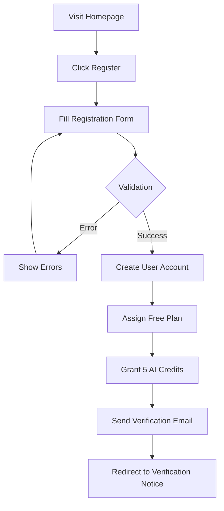

### Steps

| Step | Action | System Response |
|------|--------|-----------------|
| 1 | Click "تسجيل" (Register) | Show registration form |
| 2 | Enter name | Validate: required |
| 3 | Enter username | Validate: unique, 3-20 chars, alphanumeric |
| 4 | Enter email | Validate: unique, valid format |
| 5 | Enter password | Validate: min 8 chars |
| 6 | Confirm password | Validate: matches password |
| 7 | Click submit | Create account, send email |
| 8 | View success page | "Please verify email" message |

### Validation Rules

```php
'name' => 'required|string|max:255'
'username' => 'required|string|min:3|max:20|unique:users|alpha_dash'
'email' => 'required|string|email|max:255|unique:users'
'password' => 'required|string|min:8|confirmed'
```

### Initial User State

| Property | Value |
|----------|-------|
| Role | `user` |
| Email Verified | `false` |
| AI Recurring Credits | 5 |
| AI Bonus Credits | 0 |
| Plan | Free |

---

## 2. Email Verification

### Overview
Users must verify email before accessing protected features.

### Flowchart

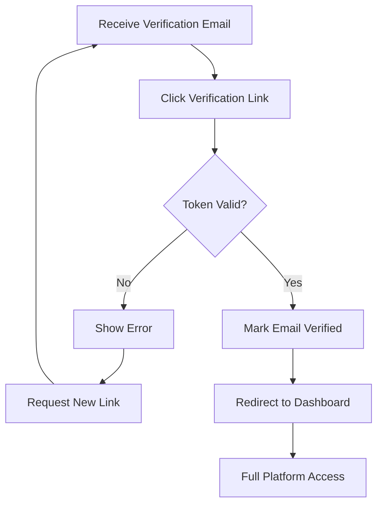

### Email Contents

| Element | Description |
|---------|-------------|
| Subject | "أهلاً بك في مُدَقِّق - تأكيد البريد" |
| Welcome Message | Custom Arabic welcome |
| Verify Button | Link with signed URL |
| Expiry | 60 minutes |

### Verification States

| State | Access Level |
|-------|-------------|
| Not Verified | Read-only, can't fact-check |
| Verified | Full user access |

---

## 3. News Fact-Checking

### Overview
Users verify claims using AI-powered fact-checking against trusted sources.

### Flowchart

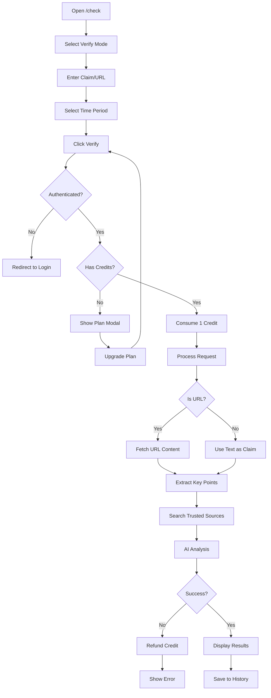

### Input Requirements

| Field | Requirement |
|-------|-------------|
| Text/URL | Required, 10-5000 characters |
| Period | Optional: 1, 3, 7, 30, or 365 days |

### Credit Consumption

```
┌─────────────────────────────────────────────────────────────────┐
│                    CREDIT FLOW                                  │
├─────────────────────────────────────────────────────────────────┤
│                                                                 │
│   User submits claim                                            │
│          ↓                                                      │
│   Check: recurring_credits + bonus_credits >= 1                 │
│          ↓                                                      │
│   ┌─────────────────────────────────────────────────────┐      │
│   │ Priority: Consume recurring first, then bonus       │      │
│   └─────────────────────────────────────────────────────┘      │
│          ↓                                                      │
│   Process request                                               │
│          ↓                                                      │
│   ┌─────────────┐          ┌─────────────┐                     │
│   │   SUCCESS   │          │   ERROR     │                     │
│   │ Credit used │          │ Credit      │                     │
│   │             │          │ refunded    │                     │
│   └─────────────┘          └─────────────┘                     │
│                                                                 │
└─────────────────────────────────────────────────────────────────┘
```

### Result Components

| Component | Description |
|-----------|-------------|
| Verdict Label | موثوق / قيد التحقق / مضلل / كاذب |
| Confidence | 0-100% |
| Summary | Arabic explanation |
| Evidence | Key points from sources |
| Sources | Links to trusted news |

### Verdict Types

| Verdict | Arabic | Description |
|---------|--------|-------------|
| `trusted` | موثوق | Claim verified as true (70-100%) |
| `checking` | قيد التحقق | Still verifying or awaiting review |
| `misleading` | مضلل | Partially true or out of context (40-69%) |
| `fake` | كاذب | Claim verified as false (0-39%) |

---

## 4. News Search

### Overview
Search mode summarizes news coverage without true/false verdict.

### Flowchart

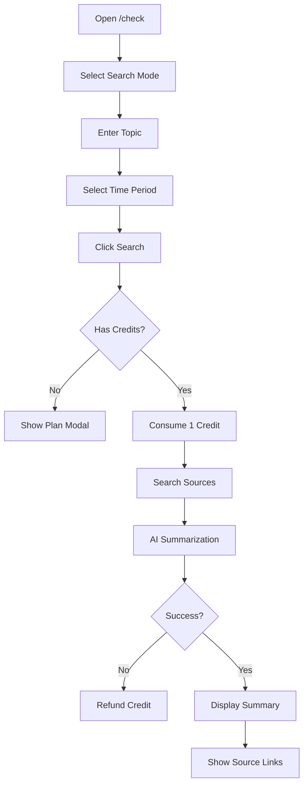

### Difference from Verify

| Aspect | Verify Mode | Search Mode |
|--------|-------------|-------------|
| Purpose | Check if claim is true | Summarize topic coverage |
| Output | Verdict (True/False) | Summary paragraph |
| Use Case | "Is this news true?" | "What's being said about X?" |

---

## 5. Journalist Application

### Overview
Users apply to become journalists with document verification.

### Flowchart

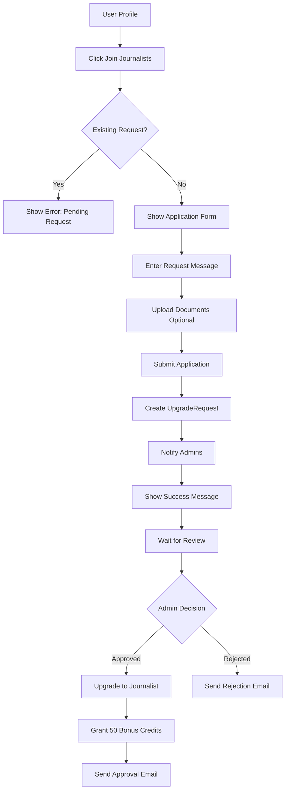

### Application Requirements

| Field | Requirement |
|-------|-------------|
| Message | Required, min 10 characters |
| Documents | Optional, PDF/DOC/DOCX/JPG/PNG, max 5MB |

### Approval Benefits

| Benefit | Details |
|---------|---------|
| Role Change | `user` → `journalist` |
| Verified Flag | `is_verified_journalist = true` |
| Credibility Score | Initial: 50 |
| Bonus Credits | +50 AI credits |
| Notification | Email + database notification |

### Status Flow

```
PENDING → ACCEPTED (upgrade user)
       → REJECTED (notify user)
       → ARCHIVED (old requests)
```

---

## 6. Article Creation

### Overview
Journalists create articles that go through AI auditing.

### Flowchart

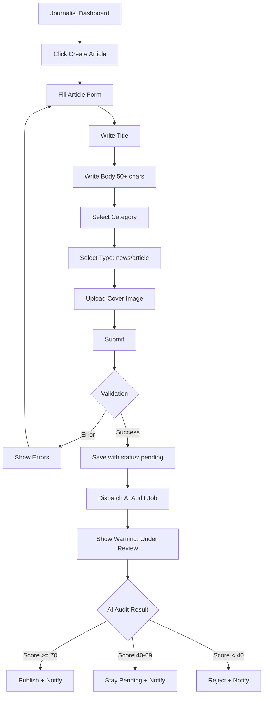

### Form Fields

| Field | Type | Validation |
|-------|------|------------|
| Title | Text | Required, max 255 |
| Body | Textarea | Required, min 50 chars |
| Category | Select | Required, must exist |
| Type | Radio | Required: `article` or `news` |
| Image | File | Required, JPEG/PNG/WebP, max 2MB |

### AI Audit Process

```
┌─────────────────────────────────────────────────────────────────┐
│                    AI AUDIT PROCESS                             │
├─────────────────────────────────────────────────────────────────┤
│                                                                 │
│   Article Body Text                                             │
│          ↓                                                      │
│   ┌─────────────────────────────────────────────────────┐      │
│   │              GROQ API (LLaMA 3.3)                    │      │
│   │  ┌─────────────────────────────────────────────┐    │      │
│   │  │ SYSTEM PROMPT:                              │    │      │
│   │  │ - Site policy rules                         │    │      │
│   │  │ - Scoring criteria                          │    │      │
│   │  │ - Output format (JSON)                      │    │      │
│   │  └─────────────────────────────────────────────┘    │      │
│   │                       ↓                              │      │
│   │  ┌─────────────────────────────────────────────┐    │      │
│   │  │ EVALUATION:                                 │    │      │
│   │  │ • Arabic language quality                   │    │      │
│   │  │ • Policy compliance                         │    │      │
│   │  │ • Hate speech detection                     │    │      │
│   │  │ • Spelling accuracy                         │    │      │
│   │  └─────────────────────────────────────────────┘    │      │
│   └─────────────────────────────────────────────────────┘      │
│          ↓                                                      │
│   { score: 85, verdict: "published", verdict_type: "trusted" } │
│                                                                 │
└─────────────────────────────────────────────────────────────────┘
```

---

## 7. Article Management

### Overview
Journalists can edit and delete their own articles.

### Edit Workflow

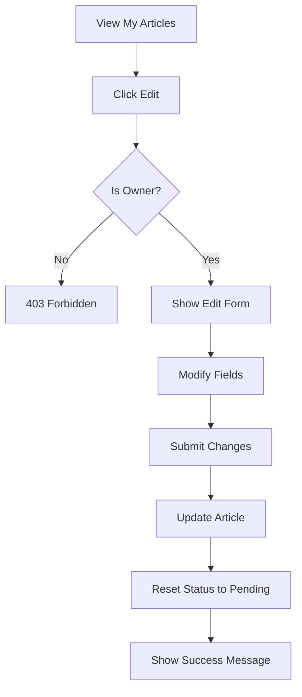

### Delete Workflow

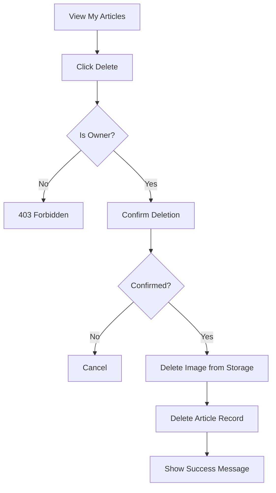

---

## 8. Subscription Purchase

### Overview
Users upgrade through Stripe checkout.

### Flowchart

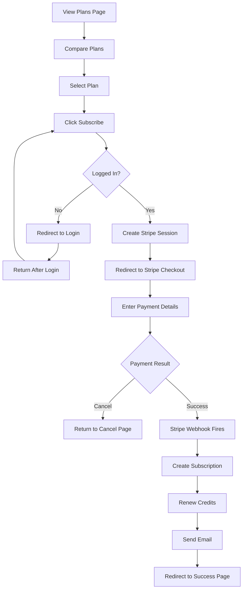

### Payment States

| State | Description |
|-------|-------------|
| Initiated | Checkout session created |
| Pending | Waiting for Stripe webhook |
| Completed | Subscription active |
| Failed | Payment declined |
| Cancelled | User cancelled checkout |

### Post-Purchase State

| Property | Change |
|----------|--------|
| Subscription | New active subscription |
| Plan | Upgraded plan |
| Credits | Renewed to plan limit |
| Ends At | Now + plan duration |

---

## 9. Post Interaction

### Like Posts

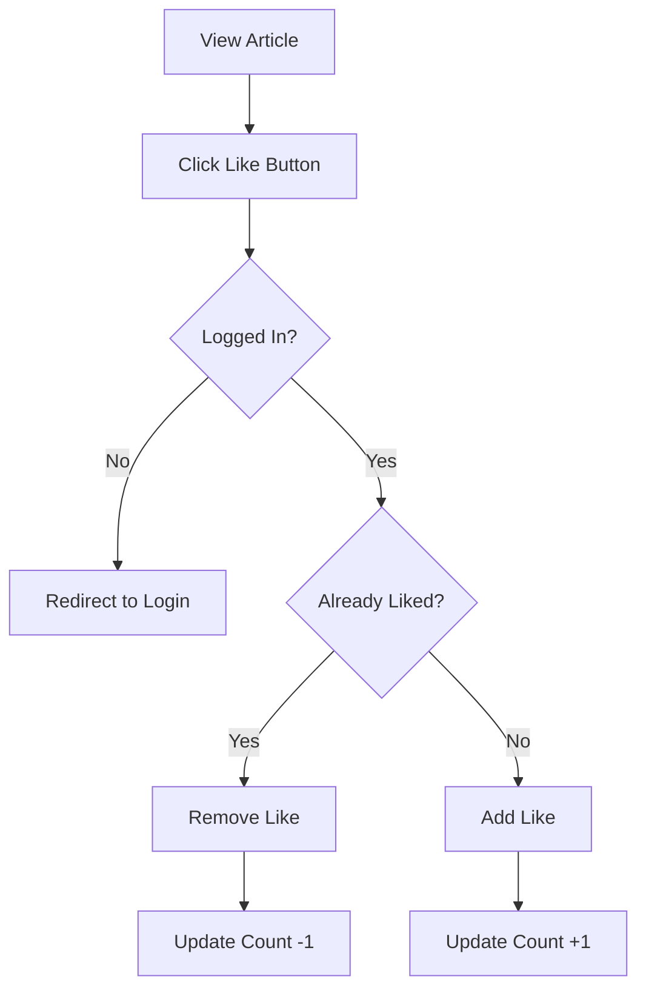

### Follow Users

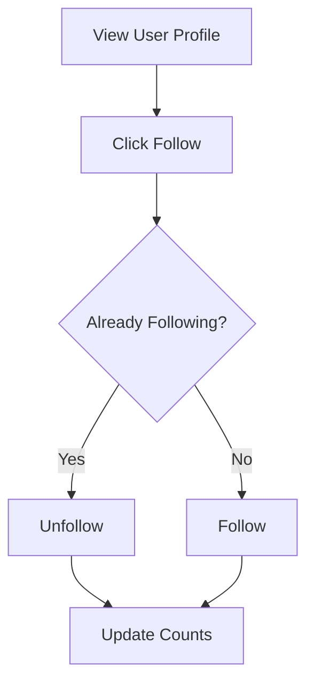

---

## 10. Content Reporting

### Overview
Users report problematic content for review.

### Flowchart

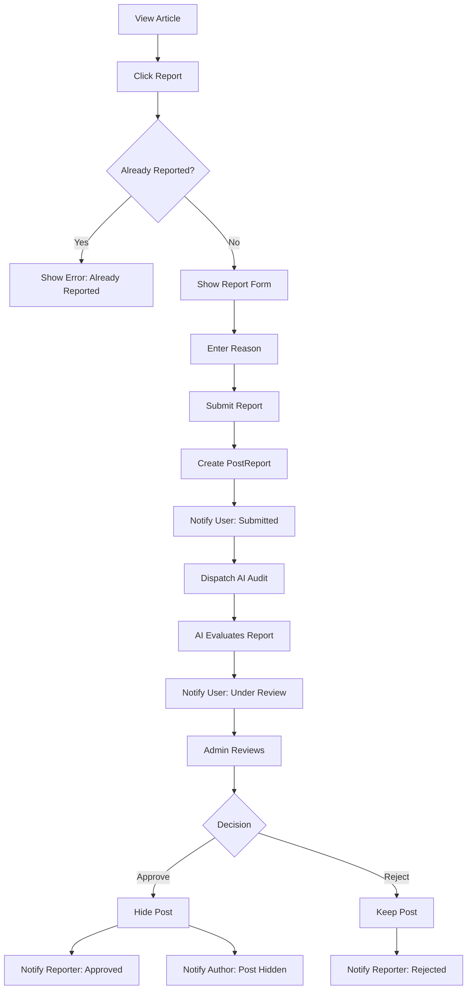

### Report Requirements

| Field | Requirement |
|-------|-------------|
| Reason | Required, 5-2000 characters |

### Report Statuses

| Status | Description |
|--------|-------------|
| `pending` | Awaiting review |
| `approved` | Report valid, post hidden |
| `rejected` | Report dismissed |

---

## 11. Profile Management

### Profile Edit

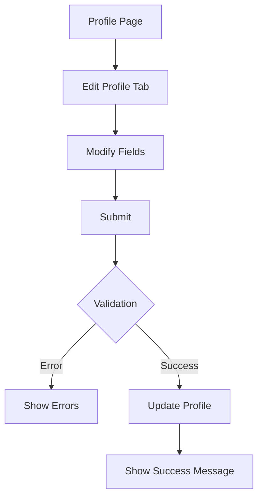

### Editable Fields

| Field | Validation |
|-------|------------|
| Name | Required, max 255 |
| Username | Required, unique, 3-20, alphanumeric |
| Email | Unique, requires re-verification if changed |

### Password Change

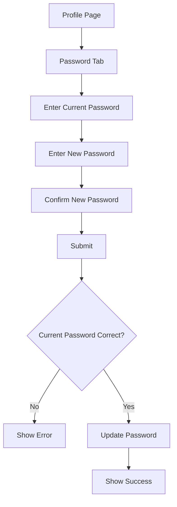

### Account Deletion

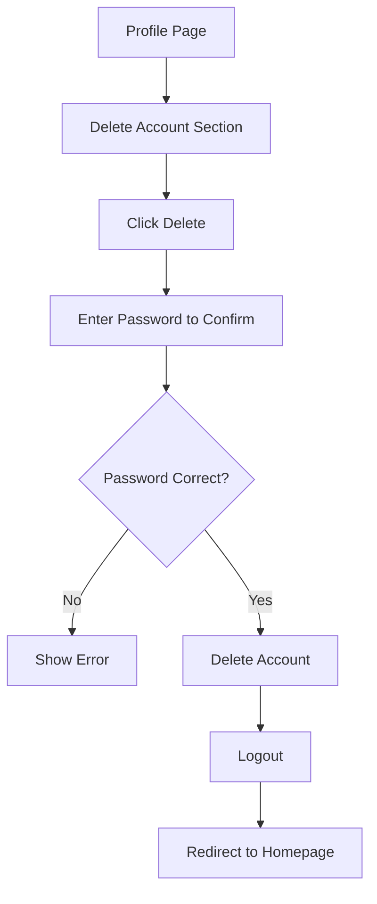

---

## 12. Notification Management

### View Notifications

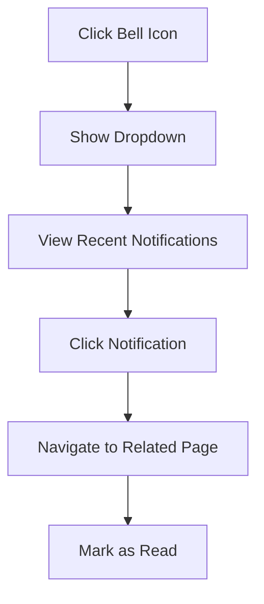

### Notification Actions

| Action | Route |
|--------|-------|
| View All | `GET /notifications` |
| Mark All Read | `POST /notifications/mark-all-read` |
| Delete Single | `DELETE /notifications/{id}` |

### Notification Types for Users

| Type | Trigger |
|------|---------|
| Welcome | Registration |
| Email Verify | Need to verify |
| Post Published | Article goes live |
| Post Rejected | Article rejected |
| Post Pending | Needs manual review |
| Report Submitted | Report created |
| Report Result | Report approved/rejected |
| Payment Success | Payment completed |
| Subscription | Created/expired |

---

## Quick Reference

### User Actions Summary

| Action | Route | Auth Required |
|--------|-------|---------------|
| Register | `POST /register` | No |
| Login | `POST /login` | No |
| Verify News | `POST /verify-news` | Yes |
| Search News | `POST /search-news` | Yes |
| Create Post | `POST /my-posts` | Journalist |
| Report Post | `POST /posts/{id}/report` | Yes |
| Like Post | `POST /posts/{id}/like` | Yes |
| Subscribe | `POST /subscribe/{plan}` | Yes |
| View Profile | `GET /profile` | Yes |

### Credit Costs

| Action | Credits |
|--------|---------|
| Verify News | 1 |
| Search News | 1 |
| Post Article | 0 (free) |
| Report Content | 0 (free) |
